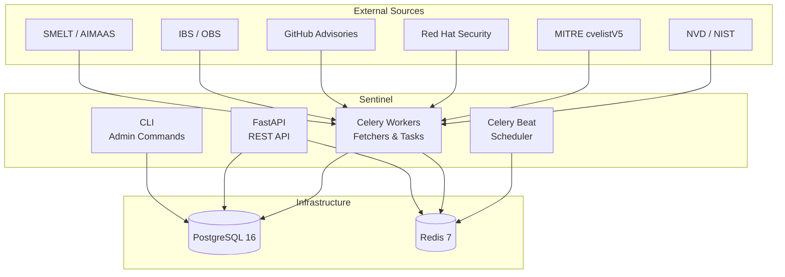

<!-- Logo placeholder: uncomment and replace when project logo is available -->
<!-- <p align="center"></p> -->

# Sentinel

[](https://github.com/StayPirate/sentinel/actions/workflows/ci.yml)
[](https://codecov.io/gh/StayPirate/sentinel)
[](https://github.com/StayPirate/sentinel/releases)
[](https://www.python.org/)
[](LICENSE)

Security update management platform for SUSE and openSUSE-based Linux
distributions. Sentinel automates CVE tracking, impact analysis, and
update coordination across multiple maintained distribution versions.

## Overview

### What Sentinel does

- Ingests CVE data from multiple public and internal sources (NVD, MITRE,
  Red Hat, GHSA, OSV, CISA KEV, EPSS, Linux Kernel CNA)
- Creates and manages security tickets from CVE detections
- Tracks which packages, codestreams, and products are affected
- Evaluates product eligibility based on CVSS thresholds and lifecycle
- Detects when security fixes are released via IBS
- Provides a REST API for vulnerability analysts, team leads, and automation
- Offers a CLI for administrative operations

### What Sentinel does NOT do

- Build or submit packages (IBS handles builds)
- Manage product lifecycle or release schedules (SMELT/AIMAAS own this)
- Provision user identities (deferred to external identity provider)
- Provide a web UI (frontend will be developed in a separate repository)

## Architecture



All runtime processes (API server, Celery worker, git worker, Celery Beat)
run from a single Docker image with different entrypoints. See
[docs/architecture.md](docs/architecture.md) for full architectural details.

## Project Status


Sentinel is in **active pre-1.0 development** (current version: `0.3.0`).
The API is not yet considered stable — breaking changes may occur in minor
version bumps.

### Feature progress

- [x] **Identity & Access Management** — authentication, RBAC, user
  management, API keys, identity audit trail
- [x] **Platform Infrastructure** *(partial)* — health endpoints, logging,
  HTTP client, system settings, CLI framework, audit trail base
- [ ] **Fetcher Infrastructure** — BaseFetcher, BaseCVEFetcher, BaseGitFetcher,
  scheduling, monitoring
- [ ] **Tickets & CVE Tracking** — ticket lifecycle, CVE ingestion from 8
  sources, CVSS scoring, severity resolution
- [ ] **Package Tracking** — product catalog, package model, three orthogonal
  dimensions, release detection
- [ ] **External Integrations** — IBS REST client, IBS RabbitMQ consumer
- [ ] **SSO Authentication** *(deferred)* — OIDC integration
- [ ] **External Identity Provisioning** *(deferred)* — directory sync

See the [implementation milestones](https://github.com/StayPirate/sentinel/milestones)
for detailed progress tracking.

## Tech Stack

| Component | Technology |
|-----------|------------|
| Language | Python 3.13 |
| API Framework | FastAPI |
| ORM | SQLAlchemy 2.0 (async, asyncpg) |
| Database | PostgreSQL 16 |
| Task Queue | Celery with Redis broker |
| Cache / Coordination | Redis 7 |
| Migrations | Alembic |
| Validation | Pydantic v2 |
| CLI | Click |
| HTTP Client | httpx |

## Getting Started

### Prerequisites

- **Python 3.13** (managed via [uv](https://docs.astral.sh/uv/))
- **Podman** or **Docker** (for local infrastructure)

### Setup

```bash
# Clone the repository
git clone git@github.com:StayPirate/sentinel.git
cd sentinel

# Install Python dependencies
cd backend && uv sync

# Start local infrastructure (PostgreSQL + Redis)
cd .. && ./scripts/dev-env.sh up

# Run database migrations
cd backend && uv run alembic upgrade head

# Start the API server
uv run uvicorn app.main:app --reload

# Run the test suite
uv run pytest
```

### Running with Docker

```bash
# Build the image
docker build -t sentinel-backend backend/

# Run the full stack (API + Worker + Beat + migrations)
docker compose -f docker-compose.smoke.yml up
```

## Documentation

| Document | Description |
|----------|-------------|
| [Architecture](docs/architecture.md) | System design and architectural decisions |
| [API Specification](docs/api-spec.md) | REST API conventions, envelope format, errors |
| [Data Model](docs/data-model.md) | Database schema and relationships |
| [Configuration](docs/configuration.md) | Environment variables reference |
| [Deployment](docs/deployment.md) | Deployment guide and CI/CD pipeline |
| [Conventions](docs/conventions.md) | Code patterns and style guide |
| [CLI Reference](docs/cli-reference.md) | CLI commands documentation |
| [Data Sources](docs/data-sources.md) | External data sources catalog |
| [Feature Specs](docs/features/) | Detailed feature specifications |

## API Documentation

Interactive API documentation (Swagger UI) is published to GitHub Pages on
every release: **[API Docs](https://staypirate.github.io/sentinel/)**

## Contributing

Contributions are welcome! Please read the [Contributing
Guide](CONTRIBUTING.md) for details on how to get started, coding
standards, and the pull request process.

## Security

To report a security vulnerability, please follow our [Security
Policy](SECURITY.md). **Do not open a public issue for security
vulnerabilities.**

## License

This project is licensed under the Apache License 2.0 — see the
[LICENSE](LICENSE) file for details.

Copyright 2025-2026 SUSE LLC
