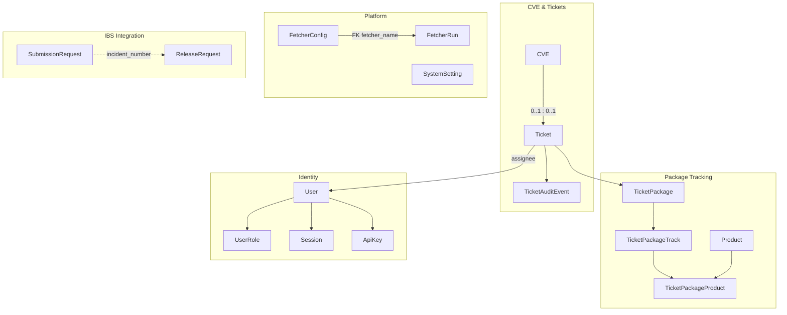
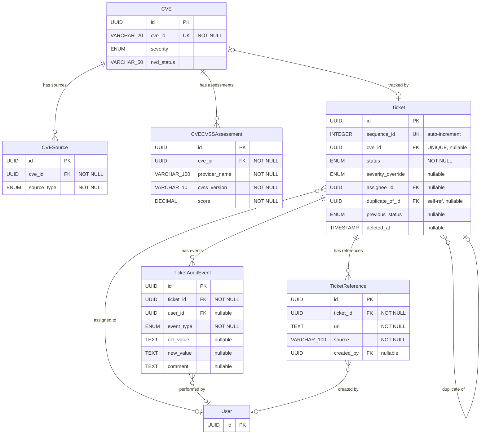
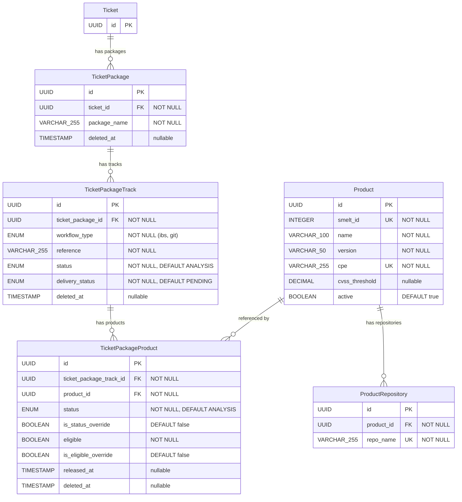
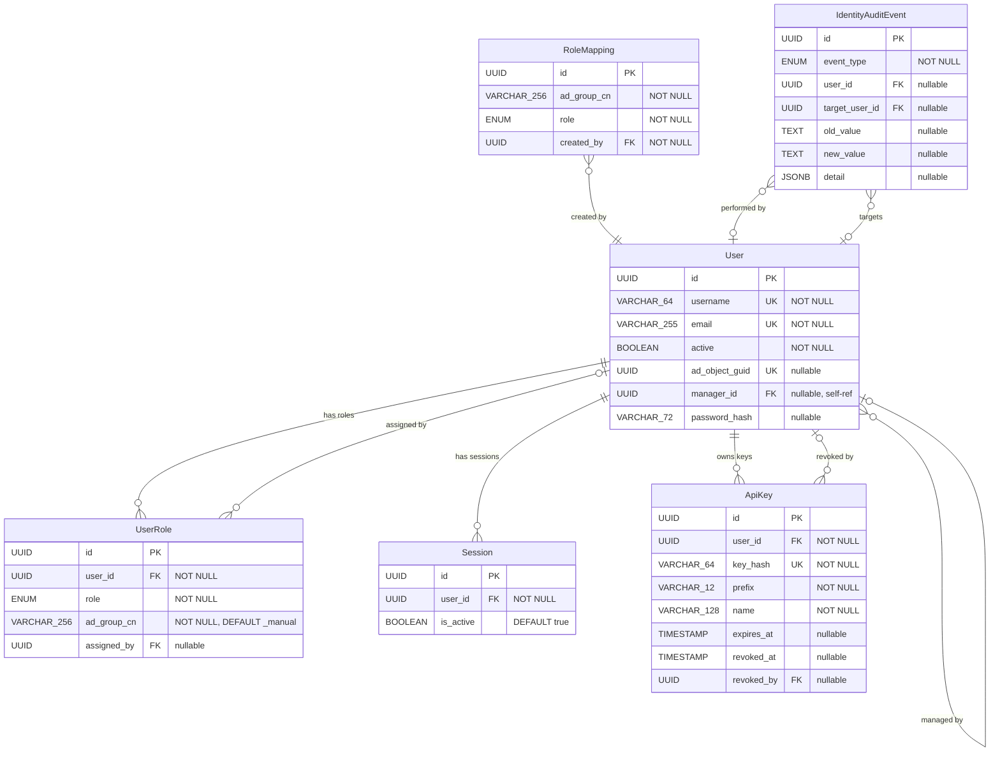
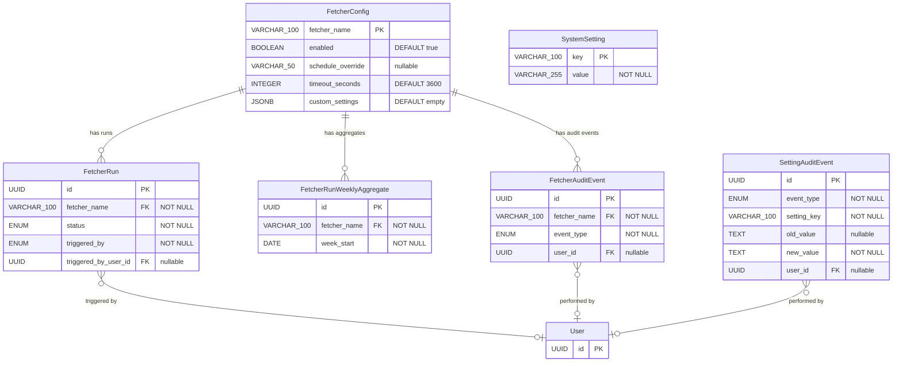
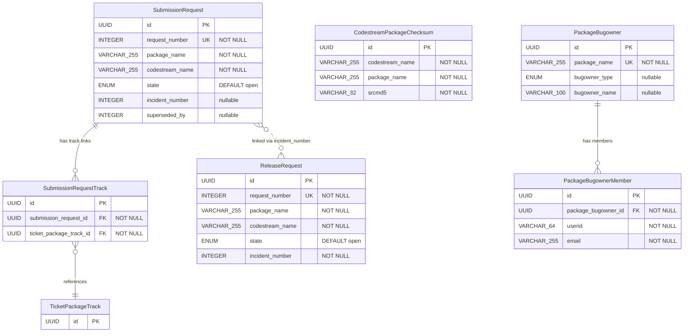

# Data Model

This document describes the database schema for Sentinel. All models are
implemented as SQLAlchemy ORM classes in `backend/app/models/`.

## Entity Relationship Overview

The data model comprises 29 entities organized into five domains. The
overview below shows the core entities and their cross-domain
relationships. Domain-specific diagrams follow with key columns (primary
keys, foreign keys, and discriminant fields). Full column definitions
are in the [Tables](#tables) section.

Entities from other domains appear as stubs (primary key only) in domain
diagrams when referenced by a foreign key. Dashed lines indicate
implicit relationships (joined by convention, no FK constraint).

### Overview

### CVE & Ticket Core

### Package Tracking

### Identity

### Platform Infrastructure

### IBS Integration

## Tables

### CVE

Represents a Common Vulnerability and Exposure entry.

| Column         | Type         | Constraints          | Description                     |
|----------------|--------------|----------------------|---------------------------------|
| id             | UUID         | PK                   | Internal identifier             |
| cve_id         | VARCHAR(20)  | UNIQUE, NOT NULL     | CVE identifier (e.g., CVE-2024-1234) |
| description    | TEXT         |                      | Vulnerability description       |
| severity       | ENUM         | NOT NULL, DEFAULT None | Critical, High, Medium, Low, None — denormalized field, always derived from CVSS assessments via the resolution cascade (see `docs/features/tickets/cvss-scoring.md`). Recalculated whenever CVSS assessments change or the default CVSS version is modified. |
| published_date | TIMESTAMP    |                      | Date CVE was published         |
| modified_date  | TIMESTAMP    |                      | Date CVE was last modified     |
| nvd_status     | VARCHAR(50)  |                      | NVD vulnerability status (e.g., `Analyzed`, `Rejected`, `Modified`). Updated during NVD sync. See `docs/features/tickets/cve-tracking.md` for handling rules. |
| created_at     | TIMESTAMP    | NOT NULL, DEFAULT    | Record creation timestamp      |
| updated_at     | TIMESTAMP    | NOT NULL, DEFAULT    | Record update timestamp        |

### CVESource

Tracks the origin of CVE data from different sources.

| Column      | Type        | Constraints      | Description                        |
|-------------|-------------|------------------|------------------------------------|
| id          | UUID        | PK               | Internal identifier                |
| cve_id      | UUID        | FK(cve.id)       | Related CVE                        |
| source_type | ENUM        | NOT NULL         | NVD, MITRE, etc.       |
| source_url  | TEXT        |                  | URL to the source entry            |
| raw_data    | JSONB       |                  | Original data from the source      |
| fetched_at  | TIMESTAMP   | NOT NULL         | When the data was fetched          |
| created_at  | TIMESTAMP   | NOT NULL, DEFAULT| Record creation timestamp          |
| updated_at  | TIMESTAMP   | NOT NULL, DEFAULT| Record update timestamp            |

### CVECVSSAssessment

Stores individual CVSS assessments from multiple providers for each CVE.
A CVE can have assessments from NVD, CNA vendors, Red Hat, and SUSE (VA
input). Each provider may supply assessments for multiple CVSS versions.
See `docs/features/tickets/cvss-scoring.md` for the full specification.

| Column        | Type          | Constraints                            | Description                        |
|---------------|---------------|----------------------------------------|------------------------------------|
| id            | UUID          | PK                                     | Internal identifier                |
| cve_id        | UUID          | FK(cve.id), NOT NULL                   | Related CVE                        |
| provider_name | VARCHAR(100) | NOT NULL                               | Human-readable provider name (e.g., `"NVD"`, `"Intel Corporation"`, `"Red Hat"`, `"SUSE"`) |
| cvss_version  | VARCHAR(10)   | NOT NULL                               | CVSS version (e.g., `"3.1"`, `"4.0"`, `"2.0"`) |
| score         | DECIMAL(3,1)  | NOT NULL                               | Calculated base score (0.0-10.0)   |
| vector        | VARCHAR(200)  | NOT NULL                               | Full CVSS vector string            |
| created_at    | TIMESTAMP     | NOT NULL, DEFAULT                      | Record creation timestamp          |
| updated_at    | TIMESTAMP     | NOT NULL, DEFAULT                      | Record update timestamp            |

**Unique constraint**: (cve_id, provider_name, cvss_version)

**Notes**:
- `provider_name` for NVD Primary assessments is always `"NVD"`
- `provider_name` for NVD Secondary (CNA) assessments is resolved from the
  NVD Source API to a human-readable name (e.g., `"Intel Corporation"`)
- `provider_name` for the SUSE internal assessment is always `"SUSE"`
- When a direct source (e.g., Red Hat API) provides data that also exists
  as an NVD Secondary, the direct source takes priority and overwrites the
  NVD Secondary record for the same `provider_name` and `cvss_version`

### SystemSetting

Key-value store for system-wide configuration. See
`docs/features/platform/admin.md` for details.

| Column     | Type        | Constraints        | Description                      |
|------------|-------------|--------------------|----------------------------------|
| key        | VARCHAR(100) | PK                 | Setting identifier (e.g., `default_cvss_version`) |
| value      | VARCHAR(255) | NOT NULL           | Setting value                    |
| updated_at | TIMESTAMP   | NOT NULL, DEFAULT  | Last modification timestamp      |

**Initial data**:

| Key                    | Initial Value |
|------------------------|---------------|
| `default_cvss_version` | `3.1`         |

### Product

Represents a SUSE product (base products, LTSS variants, ESPOS variants,
etc.). Each variant is a separate product with its own CPE. Synced
periodically from SMELT (product list and repositories) and enriched with
lifecycle data from AIMAAS. See `docs/features/packages/product-catalog.md` for
full details.

| Column               | Type         | Constraints          | Description                        |
|----------------------|--------------|----------------------|------------------------------------|
| id                   | UUID         | PK                   | Internal identifier                |
| smelt_id             | INTEGER      | UNIQUE, NOT NULL     | Product ID in SMELT                |
| name                 | VARCHAR(100) | NOT NULL             | Short product name from SMELT (e.g., `SLES-LTSS`) |
| version              | VARCHAR(50)  | NOT NULL             | Product version from SMELT (e.g., `15-SP4`) |
| display_name         | VARCHAR(255) | NOT NULL             | Human-readable full name from AIMAAS, used in the UI (e.g., `SUSE Linux Enterprise Server LTSS 15 SP4`) |
| cpe                  | VARCHAR(255) | UNIQUE, NOT NULL     | CPE identifier — primary join key between SMELT and AIMAAS |
| cvss_threshold       | DECIMAL(3,1) | nullable             | Minimum CVSS score for eligibility (from AIMAAS `cvss-threshold` endpoint). NULL means threshold is 0 (all CVEs eligible). |
| fcs                  | DATE         | nullable             | First Customer Shipment date (from AIMAAS) |
| end_of_gs            | DATE         | nullable             | End of General Support (from AIMAAS) |
| end_of_ltss          | DATE         | nullable             | End of Long Term Service Pack Support (from AIMAAS) |
| end_of_espos         | DATE         | nullable             | End of Extended Service Pack Overlap Support (from AIMAAS). Serves a similar purpose to `end_of_ltss` for products that have ESPOS instead of or in addition to LTSS. |
| end_of_reactive_ltss | DATE         | nullable             | End of Reactive LTSS (from AIMAAS). During this phase, products have `eligible = false` regardless of CVSS score. |
| active               | BOOLEAN      | NOT NULL, DEFAULT true | False when product is no longer reported by SMELT (does NOT indicate EOL — see `docs/features/packages/product-lifecycle-transitions.md` for EOL determination via AIMAAS dates) |
| smelt_synced_at      | TIMESTAMP    |                      | Last sync from SMELT               |
| aimaas_synced_at     | TIMESTAMP    |                      | Last sync from AIMAAS              |
| created_at           | TIMESTAMP    | NOT NULL, DEFAULT    | Record creation timestamp          |
| updated_at           | TIMESTAMP    | NOT NULL, DEFAULT    | Record update timestamp            |

**Unique constraint**: (name, version)

### ProductRepository

Maps SMELT repository project names to products. Used to resolve the
`target` values returned by SMELT's `maintainedpackage` endpoint to local
Product records. Synced from SMELT alongside products.

| Column     | Type      | Constraints                  | Description                        |
|------------|-----------|------------------------------|------------------------------------|
| id         | UUID      | PK                           | Internal identifier                |
| product_id | UUID      | FK(product.id), NOT NULL     | Related product                    |
| repo_name  | VARCHAR(255) | UNIQUE, NOT NULL             | SMELT repository project name (e.g., `SUSE:Updates:SLE-Product-SLES:15-SP4-LTSS:x86_64`) |
| created_at | TIMESTAMP | NOT NULL, DEFAULT            | Record creation timestamp          |

### TicketPackage

Anchors a source package within a ticket. Provides an explicit grouping
entity for tracks and products. See
`docs/features/packages/package-tracking.md` for full specification.

| Column       | Type      | Constraints                  | Description                        |
|--------------|-----------|------------------------------|------------------------------------|
| id           | UUID      | PK                           | Internal identifier                |
| ticket_id    | UUID      | FK(ticket.id), NOT NULL      | Related ticket                     |
| package_name | VARCHAR(255) | NOT NULL                     | Source package name                |
| deleted_at   | TIMESTAMP | nullable                     | Direct soft-deletion timestamp. NULL = not directly excluded. A record may still be effectively excluded via an ancestor's `deleted_at` (see hierarchical exclusion model in `docs/features/packages/package-tracking.md`) |
| created_at   | TIMESTAMP | NOT NULL, DEFAULT            | Record creation timestamp          |
| updated_at   | TIMESTAMP | NOT NULL, DEFAULT            | Record update timestamp            |

**Unique constraint**: (ticket_id, package_name)

### TicketPackageTrack

Records the affectedness and delivery status of a source package in a
specific maintenance track within the context of a ticket. The VA sets
the affectedness status at this level. The delivery status is maintained
by the system based on IBS SR/RR tracking data. See
`docs/features/packages/package-tracking.md` for status propagation
rules and the three orthogonal dimensions (affectedness, eligibility,
delivery).

| Column            | Type      | Constraints                           | Description                        |
|-------------------|-----------|---------------------------------------|------------------------------------|
| id                | UUID      | PK                                    | Internal identifier                |
| ticket_package_id | UUID      | FK(ticket_package.id), NOT NULL       | Parent package record              |
| workflow_type     | ENUM      | NOT NULL                              | WorkflowType enum (`ibs` or `git`) |
| reference         | VARCHAR(255) | NOT NULL                              | Track identifier: IBS codestream project name (e.g., `SUSE:SLE-15-SP6:Update`) or git branch name (e.g., `slfo-main`). Stored as a string — tracks are not maintained as a separate table because SMELT does not provide an independent listing. |
| status            | ENUM      | NOT NULL, DEFAULT ANALYSIS            | PackageStatus enum (affectedness)  |
| delivery_status   | ENUM      | NOT NULL, DEFAULT PENDING             | DeliveryStatus enum                |
| deleted_at        | TIMESTAMP | nullable                              | Direct soft-deletion timestamp. NULL = not directly excluded. A record may still be effectively excluded via an ancestor's `deleted_at` (see hierarchical exclusion model in `docs/features/packages/package-tracking.md`) |
| created_at        | TIMESTAMP | NOT NULL, DEFAULT                     | Record creation timestamp          |
| updated_at        | TIMESTAMP | NOT NULL, DEFAULT                     | Record update timestamp            |

**Unique constraint**: (ticket_package_id, reference)

### TicketPackageProduct

Records the affectedness status, eligibility, and release confirmation
of a source package for a specific product within the context of a
ticket and track. See `docs/features/packages/package-tracking.md` for
status inheritance, eligibility rules, and override model.

| Column                   | Type      | Constraints                                 | Description                        |
|--------------------------|-----------|---------------------------------------------|------------------------------------|
| id                       | UUID      | PK                                          | Internal identifier                |
| ticket_package_track_id  | UUID      | FK(ticket_package_track.id), NOT NULL       | Parent track record                |
| product_id               | UUID      | FK(product.id), NOT NULL                    | Related product                    |
| status                   | ENUM      | NOT NULL, DEFAULT ANALYSIS                  | PackageStatus enum (affectedness)  |
| is_status_override       | BOOLEAN   | NOT NULL, DEFAULT false                     | True if VA manually set the status |
| eligible                 | BOOLEAN   | NOT NULL                                    | Whether the product will receive the fix |
| is_eligible_override     | BOOLEAN   | NOT NULL, DEFAULT false                     | True if VA manually set the eligibility |
| released_at              | TIMESTAMP | nullable                                    | When Sentinel detected the fix in the product's update repository |
| deleted_at               | TIMESTAMP | nullable                                    | Direct soft-deletion timestamp. NULL = not directly excluded. A record may still be effectively excluded via an ancestor's `deleted_at` (see hierarchical exclusion model in `docs/features/packages/package-tracking.md`) |
| created_at               | TIMESTAMP | NOT NULL, DEFAULT                           | Record creation timestamp          |
| updated_at               | TIMESTAMP | NOT NULL, DEFAULT                           | Record update timestamp            |

**Unique constraint**: (ticket_package_track_id, product_id)

### PackageStatus Enum

Affectedness status, used by both TicketPackageTrack and
TicketPackageProduct.

| Value        | UI Label     | Color   | Type      |
|--------------|-------------|---------|-----------|
| ANALYSIS     | Analysis    | Neutral | Non-final |
| AFFECTED     | Affected    | Red     | Non-final |
| NOT_AFFECTED | Not Affected| Green   | Final     |
| FIXED        | Fixed       | Green   | Final     |
| WONT_FIX     | Won't Fix   | Green   | Final     |

### DeliveryStatus Enum

Delivery pipeline status, used by TicketPackageTrack.

| Value       | UI Label    | Color  |
|-------------|-------------|--------|
| PENDING     | Pending     | Grey   |
| IN_PROGRESS | In Progress | Orange |
| RELEASED    | Released    | Green  |

### WorkflowType Enum

| Value | Meaning                    | Example reference          |
|-------|----------------------------|----------------------------|
| ibs   | IBS project (traditional)  | `SUSE:SLE-15-SP6:Update`  |
| git   | Git branch on src.suse.de  | `slfo-main`, `slfo-1.2`   |

### User

Platform users with role-based access. Users are populated from SUSE
Active Directory via the `sync_ldap_directory` fetcher (see
`docs/features/identity/ad-integration.md`). Users can hold zero, one, or
multiple roles via the UserRole junction table. A user with no roles has
the same access as an unauthenticated user (read-only on public data).

| Column           | Type        | Constraints              | Description                      |
|------------------|-------------|--------------------------|----------------------------------|
| id               | UUID        | PK                       | Internal identifier              |
| username         | VARCHAR(64)  | UNIQUE, NOT NULL         | Login username (from AD `sAMAccountName`). Updated by LDAP sync if `sAMAccountName` changes in AD |
| email            | VARCHAR(255) | UNIQUE, NOT NULL         | Email address (from AD `mail`)   |
| full_name        | VARCHAR(255) |                          | Display name (from AD `cn`)      |
| active           | BOOLEAN     | NOT NULL, DEFAULT        | Whether the account is active (synced from AD `EMPLOYEESTATUS`) |
| password_hash    | VARCHAR(72)  | nullable                 | bcrypt hash of password (with SHA-256 pre-hash). NULL for AD users. See `docs/features/identity/local-authentication.md` |
| ad_object_guid | UUID        | UNIQUE, nullable         | AD `objectGUID` (immutable after creation). Used as the stable matching key during LDAP sync. NULL for local users |
| manager_id       | UUID        | FK(user.id), nullable    | Direct line manager (resolved from AD `manager` DN during sync). Self-referencing foreign key |
| ad_synced_at   | TIMESTAMP   | nullable                 | When this record was last synced from AD |
| last_login_at    | TIMESTAMP   | nullable                 | When the user last logged in (updated on every session creation). NULL if never logged in |
| created_at       | TIMESTAMP   | NOT NULL, DEFAULT        | Record creation timestamp        |
| updated_at       | TIMESTAMP   | NOT NULL, DEFAULT        | Record update timestamp          |

**Check constraint**: `chk_user_auth_exclusive` —
`(ad_object_guid IS NOT NULL AND password_hash IS NULL) OR (ad_object_guid IS NULL AND password_hash IS NOT NULL)`
— enforces mutual exclusivity: AD users cannot have a password, local
users must have a password. See `docs/features/identity/user-management.md`
(Business Rule 5) and `docs/features/identity/local-authentication.md`.

### UserRole

Junction table linking users to roles. A user may have zero, one, or
multiple roles assigned. The `ad_group_cn` column tracks the origin of
each role assignment: if it contains an AD group common name, the role
was derived from that group's RoleMapping; if it contains the sentinel
value `_manual`, the role was assigned directly by an admin or CLI.
Roles with `ad_group_cn != '_manual'` are managed by the LDAP sync
process and cannot be removed via the API. See
`docs/features/identity/ad-integration.md`.

| Column       | Type        | Constraints                  | Description                      |
|--------------|-------------|------------------------------|----------------------------------|
| id           | UUID        | PK                           | Internal identifier              |
| user_id      | UUID        | FK(user.id), NOT NULL        | Associated user                  |
| role         | ENUM        | NOT NULL                     | Role: Admin, Vulnerability Analyst    |
| ad_group_cn  | VARCHAR(256) | NOT NULL, DEFAULT `'_manual'` | AD group CN that granted this role, or `_manual` for manual assignments |
| assigned_by  | UUID        | FK(user.id), nullable        | User who assigned the role. NULL for system actions (LDAP sync, CLI) |
| created_at   | TIMESTAMP   | NOT NULL, DEFAULT            | When the role was assigned       |

**Unique constraint**: (user_id, role, ad_group_cn)

**Role enum values**:

| Value             | Description                                      |
|-------------------|--------------------------------------------------|
| Admin             | Platform administration (users, settings, fetchers) |
| Vulnerability Analyst  | CVE triage and assessment (tickets, packages, CVSS) |

**ad_group_cn semantics**:

| Value       | Meaning                                                        |
|-------------|----------------------------------------------------------------|
| `_manual`   | Role assigned manually by an admin via API or CLI              |
| Any other value | AD group common name — role derived from that group's RoleMapping rule |

### RoleMapping

Stores the mapping rules between Active Directory groups and Sentinel roles.
Configured by admins via the UI or API. When a mapping is created or
deleted, roles are applied or revoked immediately. During the daily LDAP
sync, existing mappings are re-evaluated against current AD group
membership. See `docs/features/identity/ad-integration.md`.

| Column       | Type        | Constraints                  | Description                        |
|--------------|-------------|------------------------------|------------------------------------|
| id           | UUID        | PK                           | Internal identifier                |
| ad_group_cn  | VARCHAR(256) | NOT NULL                     | AD group common name (e.g., `O SUSE Security`) |
| role         | ENUM        | NOT NULL                     | Sentinel role to assign: `Admin` or `Vulnerability Analyst` |
| created_by   | UUID        | FK(user.id), NOT NULL        | Admin who created this mapping     |
| created_at   | TIMESTAMP   | NOT NULL, DEFAULT            | Record creation timestamp          |

**Unique constraint**: (ad_group_cn, role)

### Session

Tracks active user sessions. Every login (SSO or local) creates a
session record. The JWT references the session via the `session_id`
claim. On every authenticated request, the middleware verifies that the
session is still active. The maximum session lifetime (30 days) is
enforced via the `session_deadline` claim in the JWT, not in this table.
See `docs/features/identity/authentication.md` (Session Management).

| Column       | Type        | Constraints               | Description                                |
|--------------|-------------|---------------------------|--------------------------------------------|
| id           | UUID        | PK                        | Internal identifier (referenced as `session_id` in JWT claims) |
| user_id      | UUID        | FK(user.id), NOT NULL     | User who owns this session                 |
| created_at   | TIMESTAMP   | NOT NULL, DEFAULT         | When the session was created (login time)  |
| is_active    | BOOLEAN     | NOT NULL, DEFAULT true    | Set to `false` on logout or user deactivation |

**Index**: (user_id, is_active) — for efficient bulk invalidation on
user deactivation.

**Cleanup**: inactive sessions (`is_active = false`) and sessions older
than 30 days (`created_at < now() - 30 days`) are deleted weekly by a
Celery Beat maintenance task. No session history is retained.

### ApiKey

API keys for programmatic access. Every user (SSO or local) can create
API keys for non-interactive authentication (bots, AI agents, CI
pipelines). The full key value is shown only once at creation; only the
hash is stored. See `docs/features/identity/authentication.md` (API Keys).

| Column        | Type        | Constraints               | Description                                |
|---------------|-------------|---------------------------|--------------------------------------------|
| id            | UUID        | PK                        | Internal identifier                        |
| user_id       | UUID        | FK(user.id), NOT NULL     | User who owns this key                     |
| key_hash      | VARCHAR(64) | NOT NULL, UNIQUE          | SHA-256 hex digest of the full key         |
| prefix        | VARCHAR(12) | NOT NULL                  | First 12 chars of the key (e.g. `stl_ak_7f3a9b`) for display |
| name          | VARCHAR(128)| NOT NULL                  | Human-readable label (e.g. "CI production") |
| created_at    | TIMESTAMP   | NOT NULL, DEFAULT         | When the key was created                   |
| last_used_at  | TIMESTAMP   | nullable                  | Last time the key was used (debounced, updated at most once per minute) |
| expires_at    | TIMESTAMP   | nullable                  | Optional expiration. NULL means never expires |
| revoked_at    | TIMESTAMP   | nullable                  | When the key was revoked. NULL means active |
| revoked_by    | UUID        | FK(user.id), nullable     | Who revoked it. NULL for system/CLI revocations. Set to user ID for self-revoke or admin revoke via UI |

**Indexes**:

- (user_id, revoked_at) — for efficient listing of active keys per user.
- UNIQUE (user_id, name) WHERE revoked_at IS NULL — prevents duplicate
  names among non-revoked keys for the same user.

### Ticket

Represents the internal workflow unit for a security issue. A ticket may
optionally be associated with a CVE (0..1:1 relationship). Tickets track
the triage and resolution lifecycle managed by vulnerability analysts (VAs).
See `docs/features/tickets/tickets.md` for the full ticket specification.

| Column            | Type        | Constraints                  | Description                          |
|-------------------|-------------|------------------------------|--------------------------------------|
| id                | UUID        | PK                           | Internal identifier                  |
| sequence_id       | INTEGER     | UNIQUE, NOT NULL, auto-increment | Human-readable ticket ID, exposed as `SNTL-{n}` (e.g., `SNTL-42`) |
| cve_id            | UUID        | FK(cve.id), UNIQUE, nullable | Associated CVE. NULL for tickets created without a CVE. A CVE can be associated later via `POST /api/v1/tickets/{id}/associate-cve` |
| status            | ENUM        | NOT NULL, DEFAULT New        | New, Analysis, Analyzed, Resolved, Ignored, Duplicated |
| severity_override | ENUM        | nullable                     | Manual severity set by the VA (Critical, High, Medium, Low, None). Used for severity resolution when `cve_id IS NULL`. Ignored when `cve_id IS NOT NULL` (automatic severity from CVSS takes precedence). See `docs/features/tickets/tickets.md` (Severity Resolution) |
| assignee_id       | UUID        | FK(user.id), nullable        | VA currently assigned to this ticket |
| duplicate_of_id   | UUID        | FK(ticket.id), nullable      | Self-referencing FK to the original ticket when status is Duplicated |
| previous_status   | ENUM        | nullable                     | Status before being marked as Duplicated, used to restore on revert |
| created_at        | TIMESTAMP   | NOT NULL, DEFAULT            | Record creation timestamp            |
| updated_at        | TIMESTAMP   | NOT NULL, DEFAULT            | Record update timestamp              |
| deleted_at        | TIMESTAMP   | nullable                     | Soft-delete timestamp. NULL means active. Set by Admin only |

**Deletion policy**: tickets MUST NOT be hard-deleted from the database.
Soft-delete is performed by setting `deleted_at` to the current timestamp.
Only users with the Admin role may soft-delete or restore tickets.
Soft-deleted tickets are excluded from all default queries. All sub-resources
of a soft-deleted ticket (references, events, packages, tracks, products)
remain intact in the database but are inaccessible to non-admin users.

**Status transitions**: see `docs/features/tickets/tickets.md` (Ticket Lifecycle)
for the full transition diagram, gates, and rules.

Summary:
- New -> Analysis (manual: assignment or any modifying operation)
- New -> Ignored (manual or automatic: NVD rejection)
- Analysis -> Analyzed (automatic: all gates met — at least one package,
  no track or product records in ANALYSIS, severity set, SUSE CVSS
  provided if CVE present)
- Analysis -> Ignored (manual)
- Analyzed -> Resolved (automatic: all packages in final status)
- Analyzed -> Analysis (automatic: gate conditions no longer met)
- Resolved -> Analyzed (automatic: resolved gates broken, analyzed gates
  still met)
- Resolved -> Analysis (automatic: both resolved and analyzed gates
  broken)
- Any -> Duplicated (manual, reversible)
- Duplicated -> previous_status (manual: revert, reassigns to the
  reverting VA)

Forward and reverse transitions between Analysis, Analyzed, and Resolved
are handled automatically by the `ticket_mutations` module — see
`docs/features/tickets/tickets.md` (Centralized Status Evaluation).

**Status categories**:
- **Active tickets**: tickets in status `New`, `Analysis`, or `Analyzed`
  **and** with `deleted_at IS NULL`. These are actively monitored: CVSS
  sync, release detection, and recalculation cascades apply to active
  tickets. Soft-deleted tickets are never considered active, regardless
  of their status.
- **Inactive tickets**: tickets in status `Resolved`, `Ignored`, or
  `Duplicated`. These are no longer monitored: CVSS sync and
  recalculation cascades skip inactive tickets.
- **Soft-deleted tickets**: tickets with `deleted_at IS NOT NULL`. These
  are excluded from all background processing (CVSS sync, release
  detection, NVD rejection handling, recalculation cascades) regardless
  of their status. They are also excluded from all default API queries
  and UI views.

### TicketReference

Stores external links associated with a ticket. References are created
automatically by CVE fetchers during ingestion and can also be added
manually by Vulnerability Analysts. See `docs/features/ui/references.md` for
the full specification.

| Column     | Type           | Constraints                  | Description                        |
|------------|----------------|------------------------------|------------------------------------|
| id         | UUID           | PK                           | Internal identifier                |
| ticket_id  | UUID           | FK(ticket.id), NOT NULL      | Related ticket                     |
| url        | TEXT           | NOT NULL                     | URL of the external resource       |
| title      | TEXT           | nullable                     | Optional human-readable label      |
| source     | VARCHAR(100)   | NOT NULL                     | Origin: fetcher name (e.g., `"sync_cves_nvd"`, `"sync_cves_mitre"`) or `"manual"` for user-added references |
| tags       | ARRAY(VARCHAR) | nullable                     | Descriptive tags from CVE data (e.g., `"Patch"`, `"Vendor Advisory"`) |
| created_by | UUID           | FK(user.id), nullable        | User who added the reference. NULL for automatic references created by fetchers |
| created_at | TIMESTAMP      | NOT NULL, DEFAULT            | Record creation timestamp          |
| updated_at | TIMESTAMP      | NOT NULL, DEFAULT            | Record update timestamp            |

**Unique constraint**: (ticket_id, url)

### AuditEventMixin

Shared SQLAlchemy mixin inherited by all audit event models. Provides
the common columns for every audit trail table. See
`docs/features/platform/audit-trail-infrastructure.md` for the full
specification.

| Column | Type | Constraints | Description |
|---|---|---|---|
| id | UUID | PK | Internal identifier |
| created_at | TIMESTAMP | NOT NULL, server default | When the event occurred |
| user_id | UUID | FK(user.id), nullable | Actor who performed the action. NULL for system-initiated actions |

**Location**: `backend/app/models/mixins.py`

All audit event models below inherit these columns from the mixin and
add their own domain-specific columns.

### TicketAuditEvent

Audit log of all changes to a ticket. Inherits `id`, `created_at`, and
`user_id` from `AuditEventMixin`. Each event represents a discrete
action (status change, assignment, duplicate operation, or automated
system action).

| Column      | Type        | Constraints            | Description                                |
|-------------|-------------|------------------------|--------------------------------------------|
| id          | UUID        | PK                     | Inherited from AuditEventMixin             |
| ticket_id   | UUID        | FK(ticket.id), NOT NULL| Related ticket                             |
| user_id     | UUID        | FK(user.id), nullable  | Inherited from AuditEventMixin. User who performed the action. NULL for automated system actions (e.g., release detection, auto-created tickets). |
| event_type  | ENUM        | NOT NULL               | See TicketAuditEventType enum below             |
| old_value   | TEXT        | nullable               | Previous value (e.g., old status, old assignee username) |
| new_value   | TEXT        | nullable               | New value (e.g., new status, new assignee username) |
| comment     | TEXT        | nullable               | Optional note from the VA, or system-generated description for automated events |
| created_at  | TIMESTAMP   | NOT NULL, DEFAULT      | Inherited from AuditEventMixin             |

### TicketAuditEventType Enum

| Value                      | Description                                        |
|----------------------------|----------------------------------------------------|
| status_change              | Ticket status was changed                          |
| assignment                 | Ticket was assigned or reassigned                  |
| duplicate_set              | Ticket was marked as duplicate of another          |
| duplicate_removed          | Duplicate mark was reverted                        |
| duplicate_target_changed   | Cascade update: the ticket's `duplicate_of_id` was re-pointed because its previous original was itself marked as duplicate. `old_value` is the previous original identifier (`SNTL-{n}`). `new_value` is the new original identifier. `user_id` is NULL (system action). |
| package_added              | Package added to the ticket (manual by VA or automatic via CPE match / track release detection). `user_id` is set for VA actions, NULL for automatic. `comment` provides context for automatic additions. |
| package_excluded           | Package directly soft-deleted from ticket by VA or orphan cleanup. `old_value` contains the package name. `user_id` is the VA who performed the action, or NULL for system (orphan cleanup). Child records are not modified — they become effectively excluded via the hierarchy. |
| package_restored           | Directly soft-deleted package restored by VA. `new_value` contains the package name. `user_id` is the VA who performed the action. Only the package record is restored — child records are not modified. |
| track_status_changed       | Track affectedness status changed. `user_id` is set for VA-initiated changes, `NULL` for automatic transitions (e.g., release detected sets FIXED). |
| track_excluded             | Track directly soft-deleted from ticket by VA or orphan cleanup. `old_value` contains the track reference. `user_id` is the VA, or NULL for system (orphan cleanup). Child products are not modified — they become effectively excluded via the hierarchy. |
| track_restored             | Directly soft-deleted track restored by VA. `new_value` contains the track reference. `user_id` is the VA. Only the track record is restored — child products are not modified. |
| track_released             | Track release detected by `IBSEventConsumer` (real-time) or `IBSTrackReleaseDetector` (periodic catch-up) — Case A. Sets `delivery_status = RELEASED` and `status = FIXED`. |
| product_status_overridden  | VA overrode product affectedness status             |
| product_released           | Product release detected via updateinfo.xml advisory |
| product_excluded           | Product directly soft-deleted from ticket by VA or lifecycle transition (EOL). `old_value` contains the product display name. `user_id` is the VA, or NULL for system (EOL, orphan). |
| product_restored           | Directly soft-deleted product restored by VA. `new_value` contains the product display name. `user_id` is the VA. |
| ticket_created             | Ticket created. Always the first event in a ticket's history. `user_id` is NULL for automatic creation (system event) or set to the creating user for manual creation. `comment` describes the creation source (e.g., `"CVE ingested from NVD"`, `"CVE fix detected in {package} ({codestream})"`, `"Ticket created manually"`) |
| cve_associated             | A CVE was associated with a ticket that previously had no CVE. `user_id` is set to the VA who performed the action. `old_value` is NULL. `new_value` is the CVE-ID string (e.g., `"CVE-2024-1234"`). |
| cve_removed                | Admin removed the CVE association from a ticket. `user_id` is the Admin who performed the action. `old_value` is the CVE-ID string. `new_value` is NULL. `comment` is an optional admin note. |
| severity_changed           | CVE severity was recalculated due to a CVSS assessment change or default CVSS version change. `old_value` and `new_value` contain severity labels. `user_id` is always NULL (system event). |
| cvss_assessment_changed    | A CVSS assessment was added, modified, or removed. `old_value` contains previous `"provider_name vX.Y score"` (or NULL if new). `new_value` contains current value (or NULL if removed). `comment` is NULL. `user_id` set for SUSE changes, NULL for external sync. |
| product_eligibility_changed | Product eligibility changed due to CVSS score recalculation, lifecycle phase transition (Reactive LTSS), threshold change, or VA override. `old_value` and `new_value` contain the eligibility value (`true`/`false`). `user_id` is set for VA overrides, NULL for system-triggered changes. `comment` format: `package_name:product_id:reason` where reason is `reactive_ltss`, `threshold`, `cvss`, or `va_override`. |
| ticket_deleted              | Ticket was soft-deleted by an Admin. `user_id` is the Admin who performed the action. `old_value` and `new_value` are NULL. `comment` is an optional admin note. |
| ticket_restored             | Soft-deleted ticket was restored by an Admin. `user_id` is the Admin who performed the action. `old_value` and `new_value` are NULL. `comment` is an optional admin note. |

### IdentityAuditEvent

Audit trail for identity-related operations: user lifecycle, role
assignments, API key management, and role mapping administration.
Inherits `id`, `created_at`, and `user_id` from `AuditEventMixin`.

| Column | Type | Constraints | Description |
|---|---|---|---|
| id | UUID | PK | Inherited from AuditEventMixin |
| event_type | ENUM | NOT NULL | See IdentityAuditEventType enum below |
| user_id | UUID | FK(user.id), nullable | Inherited from AuditEventMixin. Admin/user who performed the action. NULL for system actions (AD sync) |
| target_user_id | UUID | FK(user.id), nullable | The user affected by the action. NULL for role mapping events |
| old_value | TEXT | nullable | Previous state (human-readable). Length constraints defined by the event type contract — see `docs/features/identity/identity-audit-log.md` |
| new_value | TEXT | nullable | New state (human-readable). Length constraints defined by the event type contract — see `docs/features/identity/identity-audit-log.md` |
| detail | JSONB | nullable | Additional structured context |
| created_at | TIMESTAMP | NOT NULL, DEFAULT | Inherited from AuditEventMixin |

### IdentityAuditEventType Enum

| Value | Description |
|---|---|
| user_created | User account created (manual or AD sync) |
| user_deactivated | User account deactivated (admin or AD sync) |
| user_reactivated | User account reactivated by admin |
| password_reset | Admin reset another user's password |
| role_added | Role assigned to user (admin or AD sync) |
| role_removed | Role removed from user (admin or AD sync) |
| role_mapping_created | AD group-to-role mapping created by admin |
| role_mapping_deleted | AD group-to-role mapping deleted by admin |
| username_changed | Username changed by AD sync (sAMAccountName change) |
| api_key_created | API key created by user or admin |
| api_key_revoked | API key revoked by user, admin, or system |
| email_changed | Email address updated (admin or AD sync) |
| full_name_changed | Full name updated (admin or AD sync) |
| manager_changed | Direct manager updated by AD sync |

See `docs/features/identity/identity-audit-log.md` for the full event
type contract with field values.

### SettingAuditEvent

Audit trail for system setting modifications. Inherits `id`,
`created_at`, and `user_id` from `AuditEventMixin`.

| Column | Type | Constraints | Description |
|---|---|---|---|
| id | UUID | PK | Inherited from AuditEventMixin |
| event_type | ENUM | NOT NULL | See SettingAuditEventType enum below |
| setting_key | VARCHAR(100) | NOT NULL | Which setting was changed |
| user_id | UUID | FK(user.id), nullable | Inherited from AuditEventMixin. Admin who changed the setting. Nullable at DB level; service validates presence |
| old_value | TEXT | nullable | Previous value |
| new_value | TEXT | NOT NULL | New value |
| created_at | TIMESTAMP | NOT NULL, DEFAULT | Inherited from AuditEventMixin |

### SettingAuditEventType Enum

| Value | Description |
|---|---|
| setting_changed | Admin modified a system setting |

See `docs/features/platform/admin.md` for the full specification.

### CodestreamPackageChecksum

Operational cache table shared by the `IBSEventConsumer` (real-time) and
the `IBSTrackReleaseDetector` (periodic catch-up) to track source MD5
checksums of packages in IBS codestream projects. By comparing the
current `srcmd5` from IBS with the cached value, both mechanisms
identify which packages have changed and need a diff analysis. The shared
cache prevents duplicate work between the two detection paths. See
`docs/features/integrations/ibs-rabbitmq-integration.md`.

This table contains no domain data — it is purely an operational artifact
of the release detection mechanism.

| Column          | Type        | Constraints          | Description                        |
|-----------------|-------------|----------------------|------------------------------------|
| id              | UUID        | PK                   | Internal identifier                |
| codestream_name | VARCHAR(255) | NOT NULL             | IBS codestream project name (e.g., `SUSE:SLE-15-SP6:Update`) |
| package_name    | VARCHAR(255) | NOT NULL             | Source package name                |
| srcmd5          | VARCHAR(32)  | NOT NULL             | MD5 checksum of the package source revision from IBS |
| last_seen_at    | TIMESTAMP   | NOT NULL, DEFAULT    | When this checksum was last observed |

**Unique constraint**: (codestream_name, package_name)

### PackageBugowner

Caches the current IBS bugowner for each source package actively tracked
in Sentinel tickets. Shared across all tickets — all `TicketPackage`
records with the same `package_name` reference the same bugowner. Records
are created on-demand when a package is first added to a ticket, maintained
by the `sync_package_bugowners` fetcher, and removed when the package no
longer appears in any active ticket. See
`docs/features/packages/package-bugowner.md` for the full specification.

| Column         | Type        | Constraints          | Description                        |
|----------------|-------------|----------------------|------------------------------------|
| id             | UUID        | PK                   | Internal identifier                |
| package_name   | VARCHAR(255) | UNIQUE, NOT NULL     | Source package name (matches `TicketPackage.package_name`) |
| bugowner_type  | ENUM        | nullable             | BugownerType: `person` or `group`. NULL if the bugowner could not be resolved from IBS |
| bugowner_name  | VARCHAR(100) | nullable             | IBS userid (for person) or group name (for group). NULL if unresolved |
| bugowner_email | VARCHAR(255) | nullable             | Email of the person or collective email of the group. NULL if unresolved |
| created_at     | TIMESTAMP   | NOT NULL, DEFAULT    | Record creation timestamp          |
| updated_at     | TIMESTAMP   | NOT NULL, DEFAULT    | Record update timestamp            |

**BugownerType enum values**:

| Value   | Description                                  |
|---------|----------------------------------------------|
| person  | Individual IBS user                          |
| group   | IBS group with collective email and members  |

### PackageBugownerMember

Stores the individual members of group bugowners. Populated only when
the parent `PackageBugowner.bugowner_type` is `group`. Each record
represents one member of the IBS group. See
`docs/features/packages/package-bugowner.md` for the full specification.

| Column               | Type        | Constraints                          | Description                        |
|----------------------|-------------|--------------------------------------|------------------------------------|
| id                   | UUID        | PK                                   | Internal identifier                |
| package_bugowner_id  | UUID        | FK(package_bugowner.id), NOT NULL    | Parent bugowner record             |
| userid               | VARCHAR(64)  | NOT NULL                             | IBS username of the group member   |
| email                | VARCHAR(255) | NOT NULL                             | Email of the group member          |
| created_at           | TIMESTAMP   | NOT NULL, DEFAULT                    | Record creation timestamp          |

**Unique constraint**: (package_bugowner_id, userid)

### FetcherRun

Records every execution of a fetcher. Primary data source for the fetcher
dashboard charts. See `docs/features/platform/fetcher-infrastructure.md` for full
specification.

| Column               | Type        | Constraints              | Description                        |
|----------------------|-------------|--------------------------|-------------------------------------|
| id                   | UUID        | PK                       | Internal identifier                |
| fetcher_name         | VARCHAR(100) | FK(fetcher_config.fetcher_name) ON DELETE RESTRICT, NOT NULL, indexed | Fetcher identifier (matches `BaseFetcher.name`) |
| started_at           | TIMESTAMP   | NOT NULL                 | When the run started               |
| finished_at          | TIMESTAMP   | nullable                 | When the run ended (NULL while running) |
| duration_seconds     | FLOAT       | nullable                 | `finished_at - started_at` in seconds |
| status               | ENUM        | NOT NULL                 | FetcherRunStatus: `running`, `success`, `failure`, `partial` |
| items_created        | INTEGER     | NOT NULL, DEFAULT 0      | New records created                |
| items_updated        | INTEGER     | NOT NULL, DEFAULT 0      | Existing records updated           |
| items_failed         | INTEGER     | NOT NULL, DEFAULT 0      | Items that failed processing       |
| error_message        | TEXT        | nullable                 | Sanitized error description (for all users). See `docs/features/platform/fetcher-infrastructure.md`, "Error Message Sanitization" |
| error_detail         | TEXT        | nullable                 | Raw exception message (admin-only visibility in API) |
| error_traceback      | TEXT        | nullable                 | Full Python traceback (admin-only visibility in API) |
| triggered_by         | ENUM        | NOT NULL                 | FetcherRunTriggeredBy: `schedule`, `manual` |
| triggered_by_user_id | UUID        | FK(user.id), nullable    | Admin who triggered the run (only for `manual`) |
| created_at           | TIMESTAMP   | NOT NULL, DEFAULT        | Record creation timestamp          |

### FetcherConfig

Per-fetcher configuration managed by admins. Auto-created on worker
startup if not present.

| Column            | Type        | Constraints        | Description                        |
|-------------------|-------------|--------------------|------------------------------------|
| fetcher_name      | VARCHAR(100) | PK                 | Fetcher identifier (matches `BaseFetcher.name`) |
| enabled           | BOOLEAN     | NOT NULL, DEFAULT true | Whether the fetcher is active   |
| schedule_override | VARCHAR(50)  | nullable           | Cron expression to override the default schedule |
| timeout_seconds   | INTEGER     | NOT NULL, DEFAULT 3600 | Max execution time in seconds. Also used as stale run detection threshold. 0 disables both. |
| rate_limit        | VARCHAR(20)  | nullable           | Rate limit (e.g., `"2/s"`, `"100/m"`) |
| custom_settings   | JSONB       | NOT NULL, DEFAULT `'{}'` | Per-fetcher operational parameters. Structure defined and validated by each fetcher's `custom_settings_schema` (see `docs/features/platform/fetcher-infrastructure.md`, "Custom Settings Schema") |
| updated_at        | TIMESTAMP   | NOT NULL, DEFAULT  | Last modification timestamp        |

### FetcherAuditEvent

Audit trail for administrative actions on fetchers. Inherits `id`,
`created_at`, and `user_id` from `AuditEventMixin`.

| Column               | Type        | Constraints              | Description                        |
|----------------------|-------------|--------------------------|-------------------------------------|
| id                   | UUID        | PK                       | Inherited from AuditEventMixin     |
| fetcher_name         | VARCHAR(100) | FK(fetcher_config.fetcher_name) ON DELETE RESTRICT, NOT NULL, indexed | Fetcher identifier                 |
| event_type           | ENUM        | NOT NULL                 | FetcherAuditEventType: `disabled`, `enabled`, `triggered`, `config_changed` |
| user_id              | UUID        | FK(user.id), nullable    | Inherited from AuditEventMixin. Admin who performed the action. Nullable at DB level; service validates presence |
| detail               | JSONB       | nullable                 | Additional context (e.g., old/new config values) |
| created_at           | TIMESTAMP   | NOT NULL, DEFAULT        | Inherited from AuditEventMixin     |

### FetcherRunWeeklyAggregate

Weekly summaries of fetcher runs, created by the `aggregate_fetcher_runs`
retention task after the 90-day individual retention window.

| Column               | Type        | Constraints              | Description                        |
|----------------------|-------------|--------------------------|-------------------------------------|
| id                   | UUID        | PK                       | Internal identifier                |
| fetcher_name         | VARCHAR(100) | FK(fetcher_config.fetcher_name) ON DELETE RESTRICT, NOT NULL, indexed | Fetcher identifier                 |
| week_start           | DATE        | NOT NULL                 | Monday of the aggregation week     |
| run_count            | INTEGER     | NOT NULL                 | Total runs in the week             |
| success_count        | INTEGER     | NOT NULL                 | Runs with status `success`         |
| failure_count        | INTEGER     | NOT NULL                 | Runs with status `failure`         |
| partial_count        | INTEGER     | NOT NULL                 | Runs with status `partial`         |
| avg_duration_seconds | FLOAT       | NOT NULL                 | Average duration across all runs   |
| min_duration_seconds | FLOAT       | NOT NULL                 | Minimum duration                   |
| max_duration_seconds | FLOAT       | NOT NULL                 | Maximum duration                   |
| total_items_created  | INTEGER     | NOT NULL                 | Sum of `items_created`             |
| total_items_updated  | INTEGER     | NOT NULL                 | Sum of `items_updated`             |
| total_items_failed   | INTEGER     | NOT NULL                 | Sum of `items_failed`              |
| created_at           | TIMESTAMP   | NOT NULL, DEFAULT        | When this aggregate was created    |

**Unique constraint**: (fetcher_name, week_start)

### SubmissionRequest

Tracks an IBS submission request (type `maintenance_incident`) relevant
to Sentinel. See `docs/features/packages/ibs-submission-tracking.md`.

| Column             | Type         | Constraints              | Description                              |
|--------------------|--------------|--------------------------|------------------------------------------|
| id                 | UUID         | PK                       | Internal identifier                      |
| request_number     | INTEGER      | UNIQUE, NOT NULL         | IBS request number                       |
| package_name       | VARCHAR(255) | NOT NULL                 | Target package                           |
| codestream_name    | VARCHAR(255) | NOT NULL                 | Target codestream                        |
| state              | ENUM         | NOT NULL, DEFAULT open   | SubmissionRequestState (see below)       |
| author             | VARCHAR(64)  | nullable                 | IBS username who created the request     |
| incident_number    | INTEGER      | nullable                 | Populated when state becomes `accepted`  |
| superseded_by      | INTEGER      | nullable                 | Request number of the superseding request |
| created_at         | TIMESTAMP    | NOT NULL, DEFAULT        | Record creation timestamp                |
| updated_at         | TIMESTAMP    | NOT NULL, DEFAULT        | Record update timestamp                  |

**SubmissionRequestState enum**: `open`, `accepted`, `declined`,
`revoked`, `superseded`. `open` maps to IBS states `new` and `review`.
`declined` is non-final (can revert to `open` on reopen).

### ReleaseRequest

Tracks an IBS release request (type `maintenance_release`) relevant
to Sentinel. See `docs/features/packages/ibs-submission-tracking.md`.

| Column             | Type         | Constraints              | Description                              |
|--------------------|--------------|--------------------------|------------------------------------------|
| id                 | UUID         | PK                       | Internal identifier                      |
| request_number     | INTEGER      | UNIQUE, NOT NULL         | IBS request number                       |
| package_name       | VARCHAR(255) | NOT NULL                 | Target package                           |
| codestream_name    | VARCHAR(255) | NOT NULL                 | Target codestream                        |
| state              | ENUM         | NOT NULL, DEFAULT open   | ReleaseRequestState (see below)          |
| incident_number    | INTEGER      | NOT NULL                 | Maintenance incident number              |
| created_at         | TIMESTAMP    | NOT NULL, DEFAULT        | Record creation timestamp                |
| updated_at         | TIMESTAMP    | NOT NULL, DEFAULT        | Record update timestamp                  |

**ReleaseRequestState enum**: `open`, `accepted`, `declined`, `revoked`.
`open` maps to IBS states `new` and `review`. `declined` is non-final.

**Implicit link**: `SubmissionRequest.incident_number =
ReleaseRequest.incident_number` — the maintenance incident is not a
separate entity but an implicit linking concept.

### SubmissionRequestTrack

Links a `SubmissionRequest` to the specific `TicketPackageTrack`
records whose CVEs are mentioned in the request's diff.

| Column                   | Type      | Constraints                                | Description                        |
|--------------------------|-----------|--------------------------------------------|------------------------------------|
| id                       | UUID      | PK                                         | Internal identifier                |
| submission_request_id    | UUID      | FK(submission_request.id), NOT NULL        | Related submission request         |
| ticket_package_track_id  | UUID      | FK(ticket_package_track.id), NOT NULL      | Related track record               |
| created_at               | TIMESTAMP | NOT NULL, DEFAULT                          | Record creation timestamp          |

**Unique constraint**: (submission_request_id, ticket_package_track_id)

## Indexes

TBD — will be defined based on query patterns during implementation.

## Notes

- All tables use UUID primary keys (exceptions: `SystemSetting` uses a
  VARCHAR(100) `key` as PK; `FetcherConfig` uses `fetcher_name` VARCHAR(100) as PK)
- All tables include `created_at` and `updated_at` timestamps (exceptions:
  `TicketAuditEvent`, `IdentityAuditEvent`, `SettingAuditEvent`,
  `CodestreamPackageChecksum`, `UserRole`, `ProductRepository`,
  `PackageBugownerMember`, `FetcherRun`, `FetcherAuditEvent`,
  `FetcherRunWeeklyAggregate`, `SubmissionRequestTrack`, and `RoleMapping`
  only have `created_at` because they are immutable write-once records or are
  replaced rather than updated in place —
  `ProductRepository` records are replaced during SMELT sync, never updated
  in place; `PackageBugownerMember` records are deleted and recreated when
  group membership changes)
- ENUM types are defined as PostgreSQL enums
- JSONB is used for flexible storage of source-specific data
- The schema will evolve as features are implemented; this document must be
  updated before any schema changes
- The `CVECVSSAssessment` table supports multiple providers and CVSS
  versions — see `docs/features/tickets/cvss-scoring.md`
