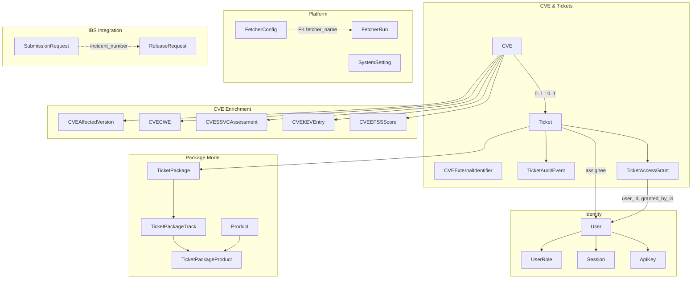
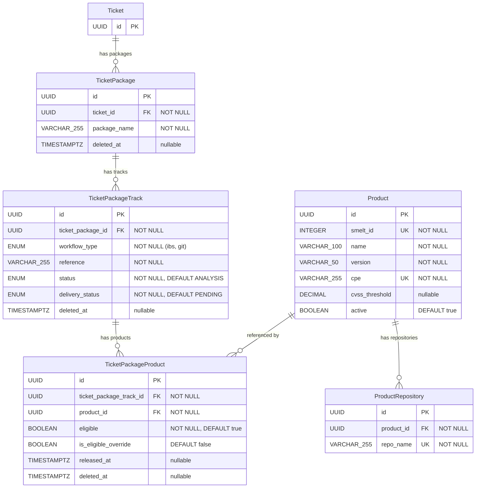
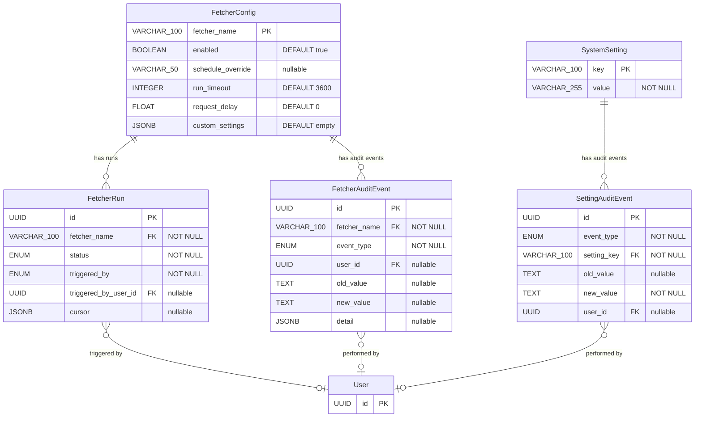
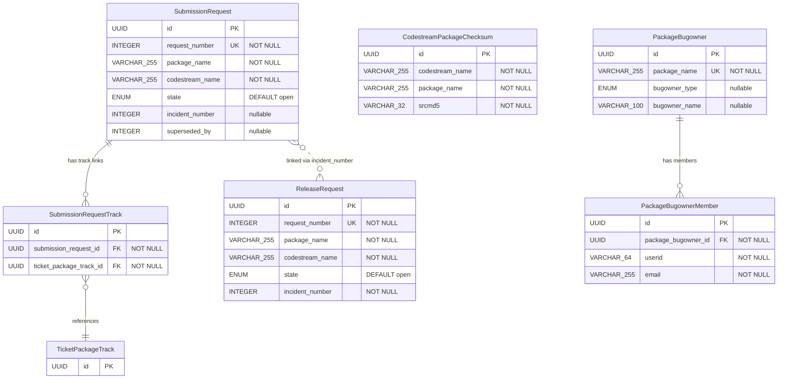

# Data Model

This document describes the database schema for Sentinel. All models are
implemented as SQLAlchemy ORM classes in `backend/app/models/`.

## Entity Relationship Overview

The data model comprises 35 entities organized into five domains. The
overview below shows the core entities and their cross-domain
relationships. Domain-specific diagrams follow with key columns (primary
keys, foreign keys, and discriminant fields). Full column definitions
are in the [Tables](#tables) section.

Entities from other domains appear as stubs (primary key only) in domain
diagrams when referenced by a foreign key. Dashed lines indicate
implicit relationships (joined by convention, no FK constraint).

### Overview



### CVE & Ticket Core

```mermaid
erDiagram
    CVE {
        UUID id PK
        VARCHAR_20 cve_id UK "NOT NULL"
        ENUM severity
        ENUM cve_state "NOT NULL, DEFAULT PUBLISHED"
        TIMESTAMPTZ date_rejected "nullable"
    }
    CVESource {
        UUID id PK
        UUID cve_id FK "NOT NULL"
        VARCHAR_100 source "NOT NULL"
        ENUM status "NOT NULL"
    }
    CVECVSSAssessment {
        UUID id PK
        UUID cve_id FK "NOT NULL"
        VARCHAR_100 provider_name "NOT NULL"
        VARCHAR_10 cvss_version "NOT NULL"
        DECIMAL score "NOT NULL"
    }
    CVEExternalIdentifier {
        UUID id PK
        UUID cve_id FK "NOT NULL"
        VARCHAR_20 source "NOT NULL"
        VARCHAR_100 identifier "NOT NULL"
    }
    CVEAffectedVersion {
        UUID id PK
        UUID cve_id FK "NOT NULL"
        VARCHAR_100 source_container "NOT NULL"
        VARCHAR_255 vendor "nullable"
        VARCHAR_255 product "nullable"
    }
    CVECWE {
        UUID id PK
        UUID cve_id FK "NOT NULL"
        VARCHAR_20 cwe_id "NOT NULL"
        VARCHAR_100 source "NOT NULL"
    }
    CVESSVCAssessment {
        UUID id PK
        UUID cve_id FK "UNIQUE, NOT NULL"
        VARCHAR_20 exploitation "NOT NULL"
    }
    CVEKEVEntry {
        UUID id PK
        UUID cve_id FK "UNIQUE, NOT NULL"
        DATE date_added "NOT NULL"
    }
    CVEEPSSScore {
        UUID id PK
        UUID cve_id FK "UNIQUE, NOT NULL"
        FLOAT score "NOT NULL"
        FLOAT percentile "NOT NULL"
    }
    Ticket {
        UUID id PK
        INTEGER sequence_id UK "auto-increment"
        UUID cve_id FK "UNIQUE, nullable"
        ENUM status "NOT NULL"
        ENUM severity_override "nullable"
        BOOLEAN is_confidential "NOT NULL, DEFAULT FALSE"
        UUID assignee_id FK "nullable"
         UUID duplicate_of_id FK "self-ref, nullable"
    }
    TicketAccessGrant {
        UUID ticket_id PK,FK "NOT NULL"
        UUID user_id PK,FK "NOT NULL"
        UUID granted_by_id FK "NOT NULL"
        TIMESTAMPTZ granted_at "NOT NULL"
    }
    TicketAuditEvent {
        UUID id PK
        UUID ticket_id FK "NOT NULL"
        UUID user_id FK "nullable"
        ENUM event_type "NOT NULL"
        TEXT old_value "nullable"
        TEXT new_value "nullable"
        TEXT comment "nullable"
        JSONB detail "nullable"
    }
    TicketReference {
        UUID id PK
        UUID ticket_id FK "NOT NULL"
        VARCHAR_2048 url "NOT NULL"
        ENUM type "nullable"
        VARCHAR_100 source "NOT NULL"
    }
    User {
        UUID id PK
    }

    CVE ||--o{ CVESource : "has sources"
    CVE ||--o{ CVECVSSAssessment : "has assessments"
    CVE ||--o{ CVEExternalIdentifier : "has external identifiers"
    CVE ||--o{ CVEAffectedVersion : "has affected versions"
    CVE ||--o{ CVECWE : "has weaknesses"
    CVE ||--o| CVESSVCAssessment : "has SSVC assessment"
    CVE ||--o| CVEKEVEntry : "is in KEV catalog"
    CVE ||--o| CVEEPSSScore : "has EPSS score"
    CVE |o--o| Ticket : "tracked by"
    Ticket ||--o{ TicketAccessGrant : "has access grants"
    Ticket ||--o{ TicketAuditEvent : "has events"
    Ticket ||--o{ TicketReference : "has references"
    Ticket }o--o| User : "assigned to"
    Ticket }o--o| Ticket : "duplicate of"
    TicketAccessGrant }o--|| User : "granted to"
    TicketAccessGrant }o--|| User : "granted by"
    TicketAuditEvent }o--o| User : "performed by"
```



### Package Model



### Identity


### Platform Infrastructure



### IBS Integration



## Tables

### CVE

Represents a Common Vulnerability and Exposure entry.

| Column         | Type         | Constraints          | Description                     |
|----------------|--------------|----------------------|---------------------------------|
| id             | UUID         | PK                   | Internal identifier             |
| cve_id         | VARCHAR(20)  | UNIQUE, NOT NULL     | CVE identifier (e.g., CVE-2024-1234) |
| title          | VARCHAR(256) |                      | Brief summary from the CNA (CVE 5.x `containers.cna.title`). Populated by fetchers that parse CVE JSON 5.x format (`sync_mitre_cves`, `sync_kernel_cves`). Null when the CNA does not provide a title. Max 256 chars per CVE schema specification |
| description    | TEXT         |                      | Vulnerability description       |
| severity       | ENUM         | NOT NULL, DEFAULT None | Critical, High, Medium, Low, None — denormalized field, always derived from CVSS assessments via the resolution cascade (see `docs/features/tickets/cvss-scoring.md`). Recalculated whenever CVSS assessments change or the default CVSS version is modified. |
| published_date | TIMESTAMPTZ    |                      | Date CVE was published         |
| modified_date  | TIMESTAMPTZ    |                      | Date CVE was last modified     |
| cve_state      | ENUM         | NOT NULL, DEFAULT PUBLISHED | CVE record state: `PUBLISHED` or `REJECTED`. Uses PostgreSQL ENUM (stable value set defined by the CVE Program). Populated by any discovery fetcher: `sync_mitre_cves` (from `cveMetadata.state`), `sync_nvd_cves` (from `vulnStatus = Rejected`), `sync_kernel_cves` (from file path: `published/` vs `rejected/`). See `docs/features/tickets/cve-tracking.md` for rejection handling rules |
| date_rejected  | TIMESTAMPTZ  | nullable             | From CVE JSON 5.x `cveMetadata.dateRejected`. Set when `cve_state` transitions to `REJECTED`, cleared when it reverts to `PUBLISHED` |
| created_at     | TIMESTAMPTZ    | NOT NULL, DEFAULT    | Record creation timestamp      |
| updated_at     | TIMESTAMPTZ    | NOT NULL, DEFAULT    | Record update timestamp        |

### CVESource

Tracks the fetch outcome for each CVE data source. One record per source
per CVE. Records are created for all outcomes — successful data ingestion,
transient failures, and sources that do not have the CVE.
See `docs/features/tickets/cve-service.md`.

| Column      | Type          | Constraints                        | Description                        |
|-------------|---------------|------------------------------------|------------------------------------|
| id          | UUID          | PK                                 | Internal identifier                |
| cve_id      | UUID          | FK(cve.id) ON DELETE CASCADE, NOT NULL | Related CVE                   |
| source      | VARCHAR(100)  | NOT NULL                           | Provider identifier (e.g., `"nvd"`, `"mitre"`, `"kernel"`, `"redhat"`). Stored as lowercase. The valid values are defined by the `CVESourceType` Python Enum in `app/core/enums.py` (evolving value set — new sources are added as the ingestion pipeline expands). Column is VARCHAR (not PG ENUM) for migration flexibility. Note: despite the shared column name `source`, each table uses a different value format. `CVESource.source` stores CVESourceType identifiers (lowercase, e.g., `"nvd"`). `CVEExternalIdentifier.source` stores naming authority labels (VARCHAR, Python Enum, e.g., `GHSA`). `CVECWE.source` stores provider names (mixed case, e.g., `"NVD"`, `"Red Hat"`). `TicketReference.source` stores `BaseFetcher.name` (e.g., `"sync_nvd_cves"`) or `"manual"` |
| status      | ENUM          | NOT NULL                           | Fetch outcome: `success` (data written), `failure` (retries exhausted), `missing` (CVE not in source). Uses PostgreSQL ENUM type `CVESourceFetchStatus`. No default — always written explicitly by the caller |
| fetched_at  | TIMESTAMPTZ   | NOT NULL                           | Timestamp of the last fetch attempt (success, failure, or missing) |
| created_at  | TIMESTAMPTZ   | NOT NULL, DEFAULT                  | Record creation timestamp          |
| updated_at  | TIMESTAMPTZ   | NOT NULL, DEFAULT                  | Record update timestamp            |

**Unique constraint**: (cve_id, source)

### CVESourceFetchStatus Enum

Outcome of a CVE data fetch attempt from an external source. Uses
PostgreSQL ENUM type (stable, closed value set — adding a new status
requires a migration).

| Value | Description |
|-------|-------------|
| `success` | Fetcher ran and wrote data successfully |
| `failure` | Fetcher ran, exhausted retries, and could not retrieve data |
| `missing` | Fetcher ran, source responded, but CVE does not exist in that source |

### CVESourceType Python Enum

"CVESourceType" is the formal term for the short lowercase provider
labels stored in `CVESource.source`. This is a **Python Enum** in
`app/core/enums.py` — NOT a PostgreSQL ENUM. The database column
remains `VARCHAR(100)` for migration flexibility (adding a new source
requires only a code change, not an Alembic migration).

| Value | Description |
|-------|-------------|
| `"nvd"` | NIST National Vulnerability Database |
| `"mitre"` | MITRE CVE Services (cvelistV5 repository) |
| `"kernel"` | Linux kernel vulnerability tracker (vulns.git) |
| `"redhat"` | Red Hat Security Data API |
| `"ghsa"` | GitHub Advisory Database (GitHub CNA) |
| `"osv"` | OSV (osv.dev) — aggregated ecosystem advisory data |
| `"kev"` | CISA Known Exploited Vulnerabilities catalog |
| `"epss"` | FIRST EPSS (Exploit Prediction Scoring System) |

**Format constraint**: values MUST match `[a-z][a-z0-9_]*` and not
exceed 100 characters (matching the `CVESource.source` VARCHAR(100)
column constraint). Enforced by a unit test on the Enum definition.

**Adding a new value**: requires two steps:
1. Add the value to the `CVESourceType` Enum in `app/core/enums.py`
2. Declare `cve_source_type` on the corresponding `BaseCVEFetcher` subclass

See `docs/features/platform/fetcher-infrastructure.md` ("CVE Source Type
Identity") for the full contract including import-time validation,
stability rules, and the `get_fetch_single_fetchers()` accessor.

Not to be confused with `BaseFetcher.name` (the fetcher registry key,
e.g., `"sync_nvd_cves"`), which is a different identifier type stored
in `TicketReference.source` and `FetcherRun.fetcher_name`.

### CVECVSSAssessment

Stores individual CVSS assessments from multiple providers for each CVE.
A CVE can have assessments from NVD, CNA vendors, Red Hat, and SUSE (VA
input). Each provider may supply assessments for multiple CVSS versions.
See `docs/features/tickets/cvss-scoring.md` for the full specification.

| Column        | Type          | Constraints                            | Description                        |
|---------------|---------------|----------------------------------------|------------------------------------|
| id            | UUID          | PK                                     | Internal identifier                |
| cve_id        | UUID          | FK(cve.id) ON DELETE CASCADE, NOT NULL | Related CVE                        |
| provider_name | VARCHAR(100) | NOT NULL                               | Human-readable provider name (e.g., `"NVD"`, `"Intel Corporation"`, `"Red Hat"`, `"SUSE"`) |
| cvss_version  | VARCHAR(10)   | NOT NULL                               | CVSS version (e.g., `"3.1"`, `"4.0"`, `"2.0"`) |
| score         | DECIMAL(3,1)  | NOT NULL                               | Calculated base score (0.0-10.0)   |
| severity      | VARCHAR(10)   | NOT NULL                               | Qualitative severity derived from vector string: `"none"`, `"low"`, `"medium"`, `"high"`, `"critical"` (stored lowercase) |
| vector_string | VARCHAR(200)  | NOT NULL                               | Full CVSS vector string            |
| created_at    | TIMESTAMPTZ     | NOT NULL, DEFAULT                      | Record creation timestamp          |
| updated_at    | TIMESTAMPTZ     | NOT NULL, DEFAULT                      | Record update timestamp            |

**Unique constraint**: (cve_id, provider_name, cvss_version)

**Notes**:
- `provider_name` for NVD Primary assessments is always `"NVD"`
- `provider_name` for NVD Secondary (CNA) assessments is resolved from the
  NVD Source API to a human-readable name (e.g., `"Intel Corporation"`)
- `provider_name` for the SUSE internal assessment is always `"SUSE"`
- `severity` is derived from the vector string using the `cvss` Python
  library's `.severities()[0]` method — never accepted as external input.
  The library returns title-case labels (e.g., `"Critical"`); these are
  normalized to lowercase before storage (e.g., `"critical"`). The library
  applies the version-specific FIRST qualitative rating scale: CVSS v2
  vectors produce labels from {low, medium, high}; v3/v4 vectors produce
  labels from {none, low, medium, high, critical}. This per-assessment
  severity is distinct from `CVE.severity`, which uses a unified scale for
  operational prioritization (see `docs/features/tickets/cvss-scoring.md`)
- When a direct source (e.g., Red Hat API) provides data that also exists
  as an NVD Secondary, both write to the same UPSERT conflict key
  `(cve_id, provider_name, cvss_version)` — last-writer-wins. Since all
  fetchers run on regular schedules, data converges to the most recent
  value within one cycle

### CVEExternalIdentifierSource Python Enum

Identifies the naming authority that assigned an external vulnerability
identifier. This is a **Python Enum** in `app/core/enums.py` — NOT a
PostgreSQL ENUM. The database column remains `VARCHAR(20)` for migration
flexibility (adding a new source requires only a code change, not an
Alembic migration).

| Value | Description |
|-------|-------------|
| `GHSA` | GitHub Security Advisory identifier |
| `PYSEC` | Python Security Advisory (PyPI) identifier |
| `RUSTSEC` | Rust Security Advisory (crates.io) identifier |

**Format constraint**: values MUST match `[A-Z][A-Z0-9_]*` and not
exceed 20 characters (matching the `CVEExternalIdentifier.source`
VARCHAR(20) column constraint). Enforced by a unit test on the Enum
definition.

**Adding a new value**: add the value to the `CVEExternalIdentifierSource`
Enum in `app/core/enums.py`. No Alembic migration required.

### CVEExternalIdentifier

Tracks external vulnerability identifiers (e.g., GHSA-ID) mapped to a
CVE by their respective naming authority. External identifiers are
populated exclusively by fetchers — there is no user-facing CRUD. The
CVE remains the sole canonical identifier in Sentinel.

| Column     | Type                                   | Constraints             | Description                              |
|------------|----------------------------------------|-------------------------|------------------------------------------|
| id         | UUID                                   | PK                      | Internal identifier                      |
| cve_id     | UUID                                   | FK(cve.id) ON DELETE CASCADE, NOT NULL | Related CVE                |
| source     | VARCHAR(20)                            | NOT NULL                | Naming authority (e.g., `GHSA`, `PYSEC`, `RUSTSEC`). Valid values defined by the `CVEExternalIdentifierSource` Python Enum in `app/core/enums.py` (evolving value set). Column is VARCHAR (not PG ENUM) for migration flexibility |
| identifier | VARCHAR(100)                           | NOT NULL                | External ID (e.g., `GHSA-xxxx-xxxx-xxxx`) |
| url        | TEXT                                   | nullable                | Direct link to the advisory page         |
| created_at | TIMESTAMPTZ                            | NOT NULL, DEFAULT       | Record creation timestamp                |
| updated_at | TIMESTAMPTZ                            | NOT NULL, DEFAULT       | Record update timestamp                  |

**Unique constraint**: (source, identifier) — each external ID is
globally unique within its naming system.

**Notes**:
- A CVE can have multiple external identifiers from different sources
  (e.g., one GHSA-ID and one RUSTSEC-ID in the future)
- A CVE can also have multiple identifiers from the same source (rare,
  but possible when multiple advisories map to one CVE)
- External identifiers persist regardless of ticket status or existence
- The `url` column stores the canonical advisory URL for UI convenience
  (e.g., `https://github.com/advisories/GHSA-xxxx-xxxx-xxxx`)

### CVEAffectedVersion

Stores affected product/version information from CVE JSON 5.x
`affected[]` arrays. Populated by multiple fetchers (both discovery
and enrichment). When `version_type = "git"`, the `version` field
contains the introducing commit SHA and `version_end` contains the
fixing commit SHA — making kernel commit tracking a natural subset of
the general affected version model. See
`docs/features/tickets/cve-service.md`.

| Column | Type | Constraints | Description |
|--------|------|-------------|-------------|
| id | UUID | PK | Internal identifier |
| cve_id | UUID | FK(cve.id) ON DELETE CASCADE, NOT NULL | Parent CVE |
| source_container | VARCHAR(100) | NOT NULL | Provenance: `"cna"`, `"adp:CISA-ADP"`, etc. Scope key for delete-and-reinsert — see fetcher contract in `docs/features/tickets/cve-service.md` (Child Table Deduplication). Both MITRE and kernel fetchers write `"cna"` (same CNA data) |
| vendor | VARCHAR(255) | nullable | Vendor name (e.g., "Linux", "Siemens") |
| product | VARCHAR(255) | nullable | Product name (e.g., "Linux", "SCALANCE XC-300") |
| package_url | TEXT | nullable | PURL identifier (CVE 5.2.0+). Useful for identifying vendored dependencies (npm, PyPI, Go) inside SUSE RPMs |
| collection_url | TEXT | nullable | Package registry URL (npm, PyPI, etc.). Pre-PURL mechanism, still used by many CNAs |
| package_name | VARCHAR(255) | nullable | Package name in the registry. Paired with `collection_url` |
| repo | TEXT | nullable | Source code repository URL |
| version | VARCHAR(255) | nullable | Single version or range start |
| version_type | VARCHAR(20) | nullable | `"semver"` / `"git"` / `"custom"` / `"rpm"` / ... |
| version_end | VARCHAR(255) | nullable | Range end (`lessThan` or `lessThanOrEqual`) |
| version_end_inclusive | BOOLEAN | nullable | `true` for `lessThanOrEqual`, `false` for `lessThan` |
| program_files | JSONB | nullable | Array of affected source files (embedded, not a separate table — used primarily for kernel CVEs, display-only) |
| cpe | VARCHAR(255) | nullable | CNA/ADP-provided CPE from `affected[]` array. Used for best-effort package resolution in Phase 2 (see `docs/features/tickets/cve-service.md`), alongside NVD CPE applicability statements passed via `cpe_matches`. Both feed the same `resolve_cpe_packages()` function |
| ecosystem | VARCHAR(50) | nullable | OSV/OSSF ecosystem identifier (e.g., `"PyPI"`, `"npm"`, `"Go"`, `"crates.io"`, `"Maven"`). Populated by `sync_osv_advisories` (canonical values from OSV schema) and `sync_ghsa_advisories` (normalized from GitHub names). NULL for fetchers without ecosystem concept (NVD, MITRE, Red Hat, Kernel) |
| created_at | TIMESTAMPTZ | NOT NULL, DEFAULT | Record creation timestamp |

Records are replaced (delete-and-reinsert per `(cve_id,
source_container)`), never updated in place — only `created_at` is
included (no `updated_at`), consistent with `ProductRepository`.

**Deduplication**: delete-and-reinsert per `(cve_id, source_container)`.
Each `upsert_cve()` call deletes all existing rows for the given
`(cve_id, source_container)` and inserts the complete set from the
payload. This is a documented exception to the `ON CONFLICT DO UPDATE`
pattern used by other child tables (`CVECWE`, `CVECVSSAssessment`,
etc.). Those tables have stable record identity — individual records
persist and are updated in place. `CVEAffectedVersion` has snapshot
semantics — the entire set is replaced per source on each sync.

**Safety-net unique constraint** (for data integrity, not used for
`ON CONFLICT`):

```sql
UNIQUE (cve_id, source_container, vendor, product,
        COALESCE(version_type, ''), COALESCE(version, ''),
        COALESCE(version_end, ''))
```

Note: `ecosystem` is intentionally excluded from the unique constraint.
The same package in different ecosystems from different sources is valid
(e.g., `"jinja2"` from OSV with `ecosystem = "PyPI"` and from GHSA with
`ecosystem = "PyPI"` share a `source_container` and are replaced
together). Different `source_container` values independently own their
own set of rows.

### CVECWE

Stores CWE (Common Weakness Enumeration) identifiers from multiple
providers. Different providers (NVD, CNA, CISA-ADP, Red Hat) frequently
assign different CWE IDs to the same CVE. Provenance tracking has value
for VA triage.

| Column | Type | Constraints | Description |
|--------|------|-------------|-------------|
| id | UUID | PK | Internal identifier |
| cve_id | UUID | FK(cve.id) ON DELETE CASCADE, NOT NULL | Parent CVE |
| cwe_id | VARCHAR(20) | NOT NULL | CWE identifier (e.g., "CWE-79") |
| source | VARCHAR(100) | NOT NULL | Provider (e.g., "NVD", "cna:Linux", "adp:CISA-ADP", "Red Hat") |
| created_at | TIMESTAMPTZ | NOT NULL, DEFAULT | Record creation timestamp |
| updated_at | TIMESTAMPTZ | NOT NULL, DEFAULT | Record update timestamp |

**Unique constraint**: (cve_id, cwe_id, source)

### CVESSVCAssessment

Stores CISA SSVC (Stakeholder-Specific Vulnerability Categorization)
decision points. Although CISA is currently the only SSVC provider
(1:1 with CVE), a dedicated table isolates the domain cleanly.

| Column | Type | Constraints | Description |
|--------|------|-------------|-------------|
| id | UUID | PK | Internal identifier |
| cve_id | UUID | FK(cve.id) ON DELETE CASCADE, UNIQUE, NOT NULL | Parent CVE (one SSVC assessment per CVE) |
| exploitation | VARCHAR(20) | NOT NULL | `"none"` / `"poc"` / `"active"` |
| automatable | VARCHAR(10) | NOT NULL | `"no"` / `"yes"` |
| technical_impact | VARCHAR(20) | NOT NULL | `"partial"` / `"total"` |
| version | VARCHAR(10) | NOT NULL | SSVC version (e.g., "2.0.3") |
| assessed_at | TIMESTAMPTZ | nullable | When the assessment was performed |
| created_at | TIMESTAMPTZ | NOT NULL, DEFAULT | Record creation timestamp |
| updated_at | TIMESTAMPTZ | NOT NULL, DEFAULT | Record update timestamp |

### CVEKEVEntry

Stores CISA Known Exploited Vulnerabilities catalog data. Although it
is a 1:1 relationship with CVE, isolating KEV data keeps the CVE table
lean and gives the `sync_cisa_kev` fetcher a clean upsert target.

| Column | Type | Constraints | Description |
|--------|------|-------------|-------------|
| id | UUID | PK | Internal identifier |
| cve_id | UUID | FK(cve.id) ON DELETE CASCADE, UNIQUE, NOT NULL | Parent CVE (one KEV entry per CVE) |
| date_added | DATE | NOT NULL | Date added to KEV catalog |
| reference_url | TEXT | nullable | URL to KEV catalog entry |
| created_at | TIMESTAMPTZ | NOT NULL, DEFAULT | Record creation timestamp |
| updated_at | TIMESTAMPTZ | NOT NULL, DEFAULT | Record update timestamp |

### CVEEPSSScore

Stores the latest FIRST EPSS (Exploit Prediction Scoring System) score
for each CVE. This is a **point-in-time snapshot** (one row per CVE),
not a time series — the record is overwritten on each daily sync.

| Column | Type | Constraints | Description |
|--------|------|-------------|-------------|
| id | UUID | PK | Internal identifier |
| cve_id | UUID | FK(cve.id) ON DELETE CASCADE, UNIQUE, NOT NULL | Parent CVE (one EPSS entry per CVE) |
| score | FLOAT | NOT NULL | Probability score (0.0 to 1.0) |
| percentile | FLOAT | NOT NULL | Percentile rank (0.0 to 1.0) |
| assessed_at | DATE | NOT NULL | Date of the EPSS assessment |
| created_at | TIMESTAMPTZ | NOT NULL, DEFAULT | Record creation timestamp |
| updated_at | TIMESTAMPTZ | NOT NULL, DEFAULT | Record update timestamp |

**FLOAT vs DECIMAL**: EPSS scores use `FLOAT` instead of the
`DECIMAL(3,1)` used by `CVECVSSAssessment.score`. CVSS scores are
used for threshold comparisons that gate eligibility decisions, where
floating-point imprecision could cause incorrect results (e.g.,
6.999... vs 7.0). EPSS scores are informational — displayed to VAs
but not used for automated threshold decisions. Additionally, EPSS
values have variable precision (e.g., 0.00043, 0.97565) that would
require a wide DECIMAL scale.

**Lifecycle**: the `sync_epss_scores` fetcher refreshes EPSS data only for
CVEs with **active tickets** (New, Analysis, Analyzed). When a ticket transitions to Resolved, Ignored,
or Duplicated, the CVEEPSSScore record is **retained** but no longer
refreshed — consistent with the CVSS lifecycle pattern
(`docs/features/tickets/cvss-scoring.md`, Sync Scope). If the ticket
later regresses to an active status (e.g., `reconcile_ticket_status()`
moves it back to Analyzed), the fetcher resumes refreshing the record
on its next run.

**UI display note**: the frontend SHOULD display the EPSS score only
for active tickets. For inactive tickets, the score
reflects the last assessment before the ticket left the active scope
and may be stale. If the UI chooses to display it for inactive
tickets, it SHOULD include a staleness indicator (e.g., "Last
assessed: {date}").

### SystemSetting

Key-value store for system-wide configuration. See
`docs/features/platform/system-settings.md` for details.

| Column     | Type        | Constraints        | Description                      |
|------------|-------------|--------------------|----------------------------------|
| key        | VARCHAR(100) | PK                 | Setting identifier (e.g., `default_cvss_version`) |
| value      | VARCHAR(255) | NOT NULL           | Setting value                    |
| updated_at | TIMESTAMPTZ   | NOT NULL, DEFAULT  | Last modification timestamp      |

**Initial data**:

| Key                    | Initial Value |
|------------------------|---------------|
| `default_cvss_version` | `3.1`         |

### Product

Represents a SUSE product (base products, LTSS variants, ESPOS variants,
etc.). Each variant is a separate product with its own CPE. Synced
periodically from SMELT (product list and repositories) and enriched with
lifecycle data from AIMAAS. See `docs/features/packages/product-catalog.md` for
full details.

| Column               | Type         | Constraints          | Description                        |
|----------------------|--------------|----------------------|------------------------------------|
| id                   | UUID         | PK                   | Internal identifier                |
| smelt_id             | INTEGER      | UNIQUE, NOT NULL     | Product ID in SMELT                |
| name                 | VARCHAR(100) | NOT NULL             | Short product name from SMELT (e.g., `SLES-LTSS`) |
| version              | VARCHAR(50)  | NOT NULL             | Product version from SMELT (e.g., `15-SP4`) |
| display_name         | VARCHAR(255) | NOT NULL             | Human-readable full name from AIMAAS, used in the UI (e.g., `SUSE Linux Enterprise Server LTSS 15 SP4`) |
| cpe                  | VARCHAR(255) | UNIQUE, NOT NULL     | CPE identifier — primary join key between SMELT and AIMAAS |
| cvss_threshold       | DECIMAL(3,1) | nullable             | Minimum CVSS score for eligibility (from AIMAAS `cvss-threshold` endpoint). NULL means threshold is 0 (all CVEs eligible). |
| fcs                  | DATE         | nullable             | First Customer Shipment date (from AIMAAS) |
| end_of_gs            | DATE         | nullable             | End of General Support (from AIMAAS) |
| end_of_ltss          | DATE         | nullable             | End of Long Term Service Pack Support (from AIMAAS) |
| end_of_espos         | DATE         | nullable             | End of Extended Service Pack Overlap Support (from AIMAAS). Serves a similar purpose to `end_of_ltss` for products that have ESPOS instead of or in addition to LTSS. |
| end_of_reactive_ltss | DATE         | nullable             | End of Reactive LTSS (from AIMAAS). During this phase, products have `eligible = false` regardless of CVSS score. |
| active               | BOOLEAN      | NOT NULL, DEFAULT true | False when product is no longer reported by SMELT (does NOT indicate EOL — see `docs/features/packages/product-lifecycle-transitions.md` for EOL determination via AIMAAS dates) |
| smelt_synced_at      | TIMESTAMPTZ    |                      | Last sync from SMELT               |
| aimaas_synced_at     | TIMESTAMPTZ    |                      | Last sync from AIMAAS              |
| created_at           | TIMESTAMPTZ    | NOT NULL, DEFAULT    | Record creation timestamp          |
| updated_at           | TIMESTAMPTZ    | NOT NULL, DEFAULT    | Record update timestamp            |

**Unique constraint**: (name, version)

### ProductRepository

Maps SMELT repository project names to products. Used to resolve the
`target` values returned by SMELT's `maintainedpackage` endpoint to local
Product records. Synced from SMELT alongside products.

| Column     | Type      | Constraints                  | Description                        |
|------------|-----------|------------------------------|------------------------------------|
| id         | UUID      | PK                           | Internal identifier                |
| product_id | UUID      | FK(product.id), NOT NULL     | Related product                    |
| repo_name  | VARCHAR(255) | UNIQUE, NOT NULL             | SMELT repository project name (e.g., `SUSE:Updates:SLE-Product-SLES:15-SP4-LTSS:x86_64`) |
| created_at | TIMESTAMPTZ | NOT NULL, DEFAULT            | Record creation timestamp          |

### TicketPackage

Anchors a source package within a ticket. Provides an explicit grouping
entity for tracks and products. See
`docs/features/packages/package-model.md` for full specification.

| Column       | Type      | Constraints                  | Description                        |
|--------------|-----------|------------------------------|------------------------------------|
| id           | UUID      | PK                           | Internal identifier                |
| ticket_id    | UUID      | FK(ticket.id), NOT NULL      | Related ticket                     |
| package_name | VARCHAR(255) | NOT NULL                     | Source package name                |
| deleted_at   | TIMESTAMPTZ | nullable                     | Direct soft-deletion timestamp. NULL = not directly excluded. A record may still be effectively excluded via an ancestor's `deleted_at` (see hierarchical exclusion model in `docs/features/packages/package-model.md`) |
| created_at   | TIMESTAMPTZ | NOT NULL, DEFAULT            | Record creation timestamp          |
| updated_at   | TIMESTAMPTZ | NOT NULL, DEFAULT            | Record update timestamp            |

**Unique constraint**: (ticket_id, package_name)

### TicketPackageTrack

Records the affectedness and delivery status of a source package in a
specific maintenance track within the context of a ticket. The VA sets
the affectedness status at this level. The delivery status is maintained
by the system based on IBS SR/RR tracking data. See
`docs/features/packages/package-model.md` for the three orthogonal
dimensions (affectedness, eligibility, delivery).

| Column            | Type      | Constraints                           | Description                        |
|-------------------|-----------|---------------------------------------|------------------------------------|
| id                | UUID      | PK                                    | Internal identifier                |
| ticket_package_id | UUID      | FK(ticket_package.id), NOT NULL       | Parent package record              |
| workflow_type     | ENUM      | NOT NULL                              | WorkflowType enum (`ibs` or `git`) |
| reference         | VARCHAR(255) | NOT NULL                              | Track identifier: IBS codestream project name (e.g., `SUSE:SLE-15-SP6:Update`) or git branch name (e.g., `slfo-main`). Stored as a string — tracks are not maintained as a separate table because SMELT does not provide an independent listing. |
| status            | ENUM      | NOT NULL, DEFAULT ANALYSIS            | PackageStatus enum (affectedness)  |
| delivery_status   | ENUM      | NOT NULL, DEFAULT PENDING             | DeliveryStatus enum                |
| deleted_at        | TIMESTAMPTZ | nullable                              | Direct soft-deletion timestamp. NULL = not directly excluded. A record may still be effectively excluded via an ancestor's `deleted_at` (see hierarchical exclusion model in `docs/features/packages/package-model.md`) |
| created_at        | TIMESTAMPTZ | NOT NULL, DEFAULT                     | Record creation timestamp          |
| updated_at        | TIMESTAMPTZ | NOT NULL, DEFAULT                     | Record update timestamp            |

**Unique constraint**: (ticket_package_id, reference)

### TicketPackageProduct

Records the eligibility and release confirmation of a source package
for a specific product within the context of a ticket and track.
Affectedness is determined exclusively at the track level. See
`docs/features/packages/package-model.md` for the eligibility rules and
override model.

| Column                   | Type      | Constraints                                 | Description                        |
|--------------------------|-----------|---------------------------------------------|------------------------------------|
| id                       | UUID      | PK                                          | Internal identifier                |
| ticket_package_track_id  | UUID      | FK(ticket_package_track.id), NOT NULL       | Parent track record                |
| product_id               | UUID      | FK(product.id), NOT NULL                    | Related product                    |
| eligible                 | BOOLEAN   | NOT NULL, DEFAULT true                      | Whether the product will receive the fix |
| is_eligible_override     | BOOLEAN   | NOT NULL, DEFAULT false                     | True if VA manually set the eligibility |
| released_at              | TIMESTAMPTZ | nullable                                    | When Sentinel detected the fix in the product's update repository |
| deleted_at               | TIMESTAMPTZ | nullable                                    | Direct soft-deletion timestamp. NULL = not directly excluded. A record may still be effectively excluded via an ancestor's `deleted_at` (see hierarchical exclusion model in `docs/features/packages/package-model.md`) |
| created_at               | TIMESTAMPTZ | NOT NULL, DEFAULT                           | Record creation timestamp          |
| updated_at               | TIMESTAMPTZ | NOT NULL, DEFAULT                           | Record update timestamp            |

**Unique constraint**: (ticket_package_track_id, product_id)

> **Soft-deletion semantics — package level**: Package/track/product-level `deleted_at`
> does NOT block mutations on those child records — soft-deleted children
> on operable tickets continue receiving updates (release detection,
> eligibility recalculation) to stay current with reality. See
> `docs/features/packages/package-service.md` (Soft-Deleted Records and
> Mutations) for the full semantics.

### PackageStatus Enum

Affectedness status, used by TicketPackageTrack.

| Value        |
|--------------|
| ANALYSIS     |
| AFFECTED     |
| NOT_AFFECTED |
| FIXED        |
| WONT_FIX     |

See `docs/features/packages/package-model.md` (Axis 1: Affectedness)
for the semantic meaning of each value and the final/non-final
classification.

### DeliveryStatus Enum

Delivery pipeline status, used by TicketPackageTrack.

| Value       |
|-------------|
| PENDING     |
| IN_PROGRESS |
| RELEASED    |

### WorkflowType Enum

| Value | Meaning                    | Example reference          |
|-------|----------------------------|----------------------------|
| ibs   | IBS project (traditional)  | `SUSE:SLE-15-SP6:Update`  |
| git   | Git branch on src.suse.de  | `slfo-main`, `slfo-1.2`   |

### User

Platform users with role-based access. Users are populated from SUSE
Active Directory via the `sync_ldap_directory` fetcher (see
`docs/features/identity/ad-integration.md`). Users can hold zero, one, or
multiple roles via the UserRole junction table. Authenticated users with
no roles have an effective scope of `non_confidential` and no
capabilities; unlike unauthenticated users, they can access specific
confidential tickets via `TicketAccessGrant` or bugowner matching.

| Column           | Type        | Constraints              | Description                      |
|------------------|-------------|--------------------------|----------------------------------|
| id               | UUID        | PK                       | Internal identifier              |
| username         | VARCHAR(64)  | UNIQUE, NOT NULL         | Login username (from AD `sAMAccountName`). Updated by LDAP sync if `sAMAccountName` changes in AD |
| email            | VARCHAR(255) | UNIQUE, NOT NULL         | Email address (from AD `mail`; stored as lowercase)   |
| full_name        | VARCHAR(255) |                          | Display name (from AD `cn`)      |
| active           | BOOLEAN     | NOT NULL, DEFAULT        | Whether the account is active (synced from AD `EMPLOYEESTATUS`) |
| password_hash    | VARCHAR(72)  | nullable                 | bcrypt hash of password (with SHA-256 pre-hash). NULL for AD users. See `docs/features/identity/local-authentication.md` |
| ad_object_guid | UUID        | UNIQUE, nullable         | AD `objectGUID` (immutable after creation). Used as the stable matching key during LDAP sync. NULL for local users |
| manager_id       | UUID        | FK(user.id), nullable    | Direct line manager (resolved from AD `manager` DN during sync). Self-referencing foreign key |
| ad_synced_at   | TIMESTAMPTZ   | nullable                 | When this record was last synced from AD |
| last_login_at    | TIMESTAMPTZ   | nullable                 | When the user last logged in (updated on every session creation). NULL if never logged in |
| created_at       | TIMESTAMPTZ   | NOT NULL, DEFAULT        | Record creation timestamp        |
| updated_at       | TIMESTAMPTZ   | NOT NULL, DEFAULT        | Record update timestamp          |

**Check constraint**: `chk_user_auth_exclusive` —
`(ad_object_guid IS NOT NULL AND password_hash IS NULL) OR (ad_object_guid IS NULL AND password_hash IS NOT NULL)`
— enforces mutual exclusivity: AD users cannot have a password, local
users must have a password. See `docs/features/identity/user-management.md`
(Business Rule 5) and `docs/features/identity/local-authentication.md`.

### UserRole

Junction table linking users to roles. A user may have zero, one, or
multiple roles assigned. The `ad_group_cn` column tracks the origin of
each role assignment: if it contains an AD group common name, the role
was derived from that group's RoleMapping; if it contains the sentinel
value `_manual`, the role was assigned directly by an admin or CLI.
Roles with `ad_group_cn != '_manual'` are managed by the LDAP sync
process and cannot be removed via the API. See
`docs/features/identity/ad-integration.md`.

| Column       | Type        | Constraints                  | Description                      |
|--------------|-------------|------------------------------|----------------------------------|
| id           | UUID        | PK                           | Internal identifier              |
| user_id      | UUID        | FK(user.id), NOT NULL        | Associated user                  |
| role         | ENUM        | NOT NULL                     | Role: Admin, Vulnerability Analyst, Restricted Analyst |
| ad_group_cn  | VARCHAR(256) | NOT NULL, DEFAULT `'_manual'` | AD group CN that granted this role, or `_manual` for manual assignments |
| assigned_by  | UUID        | FK(user.id), nullable        | User who assigned the role. NULL for system actions (LDAP sync, CLI) |
| created_at   | TIMESTAMPTZ   | NOT NULL, DEFAULT            | When the role was assigned       |

**Unique constraint**: (user_id, role, ad_group_cn)

**Role enum values**:

| Value             | Description                                      |
|-------------------|--------------------------------------------------|
| Admin             | Platform administration (users, settings, fetchers) |
| Vulnerability Analyst  | CVE triage and assessment (tickets, packages, CVSS) |
| Restricted Analyst | Ticket operations with restricted scope (same capabilities as VA except confidentiality management); scope limited to non-confidential tickets |

The capability-to-role mapping and scope-to-role mapping are static
definitions in code (not stored in the database). See
`docs/features/identity/rbac.md` for the full authorization model.

**ad_group_cn semantics**:

| Value       | Meaning                                                        |
|-------------|----------------------------------------------------------------|
| `_manual`   | Role assigned manually by an admin via API or CLI              |
| Any other value | AD group common name — role derived from that group's RoleMapping rule |

### RoleMapping

Stores the mapping rules between Active Directory groups and Sentinel roles.
Configured by admins via the UI or API. When a mapping is created or
deleted, roles are applied or revoked immediately. During the daily LDAP
sync, existing mappings are re-evaluated against current AD group
membership. See `docs/features/identity/ad-integration.md`.

| Column       | Type        | Constraints                  | Description                        |
|--------------|-------------|------------------------------|------------------------------------|
| id           | UUID        | PK                           | Internal identifier                |
| ad_group_cn  | VARCHAR(256) | NOT NULL                     | AD group common name (e.g., `O SUSE Security`) |
| role         | ENUM        | NOT NULL                     | Sentinel role to assign: `Admin`, `Vulnerability Analyst`, or `Restricted Analyst` |
| created_by   | UUID        | FK(user.id), NOT NULL        | Admin who created this mapping     |
| created_at   | TIMESTAMPTZ   | NOT NULL, DEFAULT            | Record creation timestamp          |

**Unique constraint**: (ad_group_cn, role)

### Session

Tracks active user sessions. Every login (SSO or local) creates a
session record. The JWT references the session via the `session_id`
claim. On every authenticated request, the middleware verifies that the
session is still active. The maximum session lifetime
(`SESSION_MAX_LIFETIME_DAYS`, default 30 days) is enforced via the
`session_deadline` claim in the JWT, not in this table.
See `docs/features/identity/authentication.md` (Session Management).

| Column       | Type        | Constraints               | Description                                |
|--------------|-------------|---------------------------|--------------------------------------------|
| id           | UUID        | PK                        | Internal identifier (referenced as `session_id` in JWT claims) |
| user_id      | UUID        | FK(user.id), NOT NULL     | User who owns this session                 |
| created_at   | TIMESTAMPTZ   | NOT NULL, DEFAULT         | When the session was created (login time)  |
| updated_at   | TIMESTAMPTZ   | NOT NULL, DEFAULT now()   | Last modification timestamp; records when session was invalidated |
| is_active    | BOOLEAN     | NOT NULL, DEFAULT true    | Set to `false` on logout or user deactivation |

**Index**: (user_id, is_active) — for efficient bulk invalidation on
user deactivation.

**Cleanup**: inactive sessions (`is_active = false`) and sessions older
than `SESSION_MAX_LIFETIME_DAYS + 1` days
(`created_at < now() - (SESSION_MAX_LIFETIME_DAYS + 1) days`) are
deleted weekly by a Celery Beat maintenance task. No session history is
retained.

### ApiKey

API keys for programmatic access. Every user (SSO or local) can create
API keys for non-interactive authentication (bots, AI agents, CI
pipelines). The full key value is shown only once at creation; only the
hash is stored. See `docs/features/identity/authentication.md` (API Keys).

| Column        | Type        | Constraints               | Description                                |
|---------------|-------------|---------------------------|--------------------------------------------|
| id            | UUID        | PK                        | Internal identifier                        |
| user_id       | UUID        | FK(user.id), NOT NULL     | User who owns this key                     |
| key_hash      | VARCHAR(64) | NOT NULL, UNIQUE          | SHA-256 hex digest of the full key         |
| prefix        | VARCHAR(12) | NOT NULL                  | First 12 chars of the key (e.g. `stl_ak_7f3a9`) for display |
| name          | VARCHAR(128)| NOT NULL                  | Human-readable label (e.g. "CI production") |
| created_at    | TIMESTAMPTZ   | NOT NULL, DEFAULT         | When the key was created                   |
| last_used_at  | TIMESTAMPTZ   | nullable                  | Last time the key was used (debounced, updated at most once per minute) |
| expires_at    | TIMESTAMPTZ   | nullable                  | Optional expiration. NULL means never expires |
| revoked_at    | TIMESTAMPTZ   | nullable                  | When the key was revoked. NULL means active |
| revoked_by    | UUID        | FK(user.id), nullable     | Who revoked it. NULL for system/CLI revocations. Set to user ID for self-revoke or admin revoke via UI |

**Indexes**:

- (user_id, revoked_at) — for efficient listing of active keys per user.
- UNIQUE (user_id, name) WHERE revoked_at IS NULL — prevents duplicate
  names among non-revoked keys for the same user.

### Ticket

Represents the internal workflow unit for a security issue. A ticket may
optionally be associated with a CVE (0..1:1 relationship). Tickets track
the triage and resolution lifecycle managed by vulnerability analysts (VAs).
See `docs/features/tickets/tickets.md` for the full ticket specification.

| Column            | Type        | Constraints                  | Description                          |
|-------------------|-------------|------------------------------|--------------------------------------|
| id                | UUID        | PK                           | Internal identifier                  |
| sequence_id       | INTEGER     | UNIQUE, NOT NULL, auto-increment | Human-readable ticket ID, exposed as `SNTL-{n}` (e.g., `SNTL-42`) |
| cve_id            | UUID        | FK(cve.id), UNIQUE, nullable | Associated CVE. NULL for tickets created without a CVE. A CVE can be associated later via `POST /api/v1/tickets/{id}/associate-cve` |
| status            | ENUM        | NOT NULL, DEFAULT New        | New, Analysis, Analyzed, Resolved, Ignored, Duplicated |
| severity_override | ENUM        | nullable                     | Manual severity set by the VA (Critical, High, Medium, Low, None). Used for severity resolution when `cve_id IS NULL`. Ignored when `cve_id IS NOT NULL` (automatic severity from CVSS takes precedence). See `docs/features/tickets/tickets.md` (Severity Resolution) |
| assignee_id       | UUID        | FK(user.id), nullable        | VA currently assigned to this ticket |
| duplicate_of_id   | UUID        | FK(ticket.id), nullable      | Self-referencing FK to the canonical target ticket when status is Duplicated. May transiently reference a Duplicated ticket if a flattening was interrupted; the `resolve_canonical_target` function handles resolution at read time. Hop limit: 50 |
| created_at        | TIMESTAMPTZ   | NOT NULL, DEFAULT            | Record creation timestamp            |
| updated_at        | TIMESTAMPTZ   | NOT NULL, DEFAULT            | Record update timestamp              |
| is_confidential   | BOOLEAN       | NOT NULL, DEFAULT FALSE      | When TRUE, access is restricted to authorized users only. See `docs/features/tickets/tickets.md` (Confidential Tickets) |


**Deletion policy**: Tickets MUST NOT be deleted from the database. There is no soft-delete mechanism at the ticket level. Tickets that are no longer relevant are transitioned to Ignored or Duplicated status.

**Status transitions**: see `docs/features/tickets/tickets.md` (Ticket Lifecycle)
for the full transition diagram, gates, and rules.

Summary:
- New -> Analysis (manual: assignment or any modifying operation)
- New -> Ignored (manual or automatic: NVD rejection)
- Analysis -> Analyzed (automatic: all gates met — at least one package,
  no track records in ANALYSIS, severity set, SUSE CVSS
  provided if CVE present)
- Analysis -> Ignored (manual)
- Analyzed -> Resolved (automatic: all tracks resolution-complete)
- Analyzed -> Analysis (automatic: gate conditions no longer met)
- Resolved -> Analyzed (automatic: resolved gates broken, analyzed gates
  still met)
- Resolved -> Analysis (automatic: both resolved and analyzed gates
  broken)
- Any except Ignored and Duplicated -> Duplicated (manual, reversible)
- Duplicated -> (evaluated status) (manual: revert via
  `_reenter_gate_zone`; reassigns to the reverting VA)
- Ignored -> (evaluated status) (manual: VA assigns; or automatic:
  system reopens via `_reenter_gate_zone`)

Forward and reverse transitions between Analysis, Analyzed, and Resolved
are handled automatically by the `ticket_mutations` module — see
`docs/features/tickets/ticket-mutations.md`.
Exits from the manual zone (Ignored, Duplicated) use the shared
`_reenter_gate_zone` helper which sets `status = Analysis` (floor of
the gate zone) and calls `reconcile_ticket_status`, which may promote
further to `Analyzed` or `Resolved` if gate conditions are satisfied.

**Status categories**:
- **Active tickets**: tickets in status `New`, `Analysis`, or `Analyzed`.
  These are actively monitored: CVSS
   sync, release detection, and recalculation chains apply to active
   tickets.
- **Inactive tickets**: tickets in status `Resolved`, `Ignored`, or
  `Duplicated`. These are no longer monitored: CVSS sync and
   recalculation chains skip inactive tickets.

### TicketReference

Stores external links associated with a ticket. References are created
automatically by CVE fetchers during ingestion and can also be added
manually by users with the `manage_references` capability. See
`docs/features/tickets/ticket-references.md` for the full specification.

| Column      | Type                       | Constraints                  | Description                        |
|-------------|----------------------------|------------------------------|------------------------------------|
| id          | UUID                       | PK                           | Internal identifier                |
| ticket_id   | UUID                       | FK(ticket.id) ON DELETE CASCADE, NOT NULL | Related ticket                     |
| url         | VARCHAR(2048)              | NOT NULL                     | URL of the external resource. Stored in normalized form: scheme + host lowercased, `http` upgraded to `https`, empty trailing slash removed (see `docs/features/tickets/ticket-references.md`, Upsert Strategy § URL Normalization) |
| title       | VARCHAR(500)               | nullable                     | Human-readable label               |
| description | VARCHAR(2000)              | nullable                     | Short note explaining relevance    |
| type        | ENUM(ReferenceType)        | nullable                     | Content classification. NULL = uncategorized |
| source      | VARCHAR(100)               | NOT NULL                     | Origin: fetcher name (e.g., `"sync_nvd_cves"`) or `"manual"` for user-added references |
| created_at  | TIMESTAMPTZ                | NOT NULL, DEFAULT            | Record creation timestamp          |
| updated_at  | TIMESTAMPTZ                | NOT NULL, DEFAULT            | Record update timestamp            |

**Unique constraint**: (ticket_id, url)

### ReferenceType Enum

Classifies the content that a reference URL points to. Used by the
`TicketReference.type` column.

| Value      | Description                                              |
|------------|----------------------------------------------------------|
| `advisory` | Security advisory (NVD, GHSA, vendor advisory, VDB entry) |
| `patch`    | Fix artifact: patch, commit, pull request, merge request |
| `issue`    | Bug tracker entry, issue report                          |
| `article`  | Blog post, write-up, technical analysis, mailing list post |

A `NULL` type means the reference could not be classified. See
`docs/features/tickets/ticket-references.md` (Type Auto-Classification)
for the three-tier classification mechanism.

### AuditEventMixin

Shared SQLAlchemy mixin inherited by all audit event models. Provides
the common columns for every audit trail table. See
`docs/features/platform/audit-trail-infrastructure.md` for the full
specification.

| Column | Type | Constraints | Description |
|---|---|---|---|
| id | UUID | PK | Internal identifier |
| created_at | TIMESTAMPTZ | NOT NULL, server default | When the event occurred |
| user_id | UUID | FK(user.id), nullable | Actor who performed the action. NULL for system-initiated actions |

**Location**: `backend/app/models/mixins.py`

All audit event models below inherit these columns from the mixin and
add their own domain-specific columns.

### TicketAuditEvent

Audit log of all changes to a ticket. Inherits `id`, `created_at`, and
`user_id` from `AuditEventMixin`. Each event represents a discrete
action (status change, assignment, duplicate operation, or automated
system action).

| Column      | Type        | Constraints            | Description                                |
|-------------|-------------|------------------------|--------------------------------------------|
| id          | UUID        | PK                     | Inherited from AuditEventMixin             |
| ticket_id   | UUID        | FK(ticket.id), NOT NULL| Related ticket                             |
| user_id     | UUID        | FK(user.id), nullable  | Inherited from AuditEventMixin. User who performed the action. NULL for automated system actions (e.g., release detection, auto-created tickets). |
| event_type  | ENUM        | NOT NULL               | See TicketAuditEventType enum below             |
| old_value   | TEXT        | nullable               | Previous value (e.g., old status, old assignee username) |
| new_value   | TEXT        | nullable               | New value (e.g., new status, new assignee username) |
| comment     | TEXT        | nullable               | Free-text note from the VA, or human-readable system-generated description for automated events |
| detail      | JSONB       | nullable               | Additional structured context. Schema validated per event type — see `docs/features/tickets/ticket-audit-log.md` (detail JSONB Schema Contract) |
| created_at  | TIMESTAMPTZ   | NOT NULL, DEFAULT      | Inherited from AuditEventMixin             |

### TicketAuditEventType Enum

| Value                      | Description                                        |
|----------------------------|----------------------------------------------------|
| status_change              | Ticket status was changed                          |
| assignment                 | Ticket was assigned or reassigned                  |
| duplicate_set              | Ticket was marked as duplicate of another          |
| duplicate_removed          | Duplicate mark was reverted                        |
| duplicate_target_changed   | Flattening update: the ticket's `duplicate_of_id` was re-pointed because its previous canonical target was itself marked as duplicate. `old_value` is the previous canonical target identifier (`SNTL-{n}`). `new_value` is the new canonical target identifier. `user_id` is NULL (system action). `detail` contains `{"triggered_by_ticket": "SNTL-{n}"}` identifying the ticket whose mark-as-duplicate operation triggered the flattening. This event may be absent if flattening was interrupted (not an error). |
| package_added              | Package added to the ticket (manual by VA or automatic via CVE ingestion / track release detection). `user_id` is set for VA actions, NULL for automatic. `comment` provides context for automatic additions. |
| package_excluded           | Package directly soft-deleted from ticket by VA or orphan cleanup. `old_value` contains the package name. `user_id` is the VA who performed the action, or NULL for system (orphan cleanup). `detail` carries `{"reason"}` for automatic exclusions, NULL for manual. Child records are not modified — they become effectively excluded via the hierarchy. |
| package_restored           | Directly soft-deleted package restored by VA. `new_value` contains the package name. `user_id` is the VA who performed the action. Only the package record is restored — child records are not modified. |
| track_status_changed       | Track affectedness status changed. `user_id` is set for VA-initiated changes, `NULL` for automatic transitions (e.g., release detected sets FIXED). `detail` carries `{"track", "package"}` context. |
| track_excluded             | Track directly soft-deleted from ticket by VA or orphan cleanup. `old_value` contains the track reference. `user_id` is the VA, or NULL for system (orphan cleanup). `detail` carries `{"track", "package", "reason"}` context. Child products are not modified — they become effectively excluded via the hierarchy. |
| track_restored             | Directly soft-deleted track restored by VA. `new_value` contains the track reference. `user_id` is the VA. Only the track record is restored — child products are not modified. |
| product_released           | Product release detected via updateinfo.xml advisory. `detail` carries `{"track", "package", "product_id", "advisory_id"}` context. |
| product_excluded           | Product directly soft-deleted from ticket by VA or lifecycle transition (EOL). `old_value` contains the product display name. `user_id` is the VA, or NULL for system (EOL, orphan). `detail` carries `{"track", "package", "product_id", "reason"}` context. |
| product_restored           | Directly soft-deleted product restored by VA. `new_value` contains the product display name. `user_id` is the VA. |
| ticket_created             | Ticket created. Always the first event in a ticket's history. `user_id` is NULL for automatic creation (system event) or set to the creating user for manual creation. `comment` describes the creation source (e.g., `"CVE ingested from NVD"`, `"CVE fix detected in {package} ({codestream})"`, `"Ticket created manually"`) |
| cve_associated             | A CVE was associated with a ticket that previously had no CVE. `user_id` is set to the VA who performed the action. `old_value` is NULL. `new_value` is the CVE-ID string (e.g., `"CVE-2024-1234"`). |
| severity_changed           | NULL for automatic CVSS recalculation, acting user's UUID for manual severity override. |
| cvss_assessment_changed    | A CVSS assessment was added, modified, or removed. `old_value` contains previous `"provider_name vX.Y score"` (or NULL if new). `new_value` contains current value (or NULL if removed). `comment` is NULL. `user_id` set for SUSE changes, NULL for external sync. |
| product_eligibility_changed | Product eligibility changed due to CVSS score recalculation, lifecycle phase transition (Reactive LTSS), threshold change, or VA override. `old_value` and `new_value` contain the eligibility value (`true`/`false`). `user_id` is set for VA overrides, NULL for system-triggered changes. `detail` carries `{"track", "package", "product_id", "reason"}` context where reason is `reactive_ltss`, `threshold`, `cvss`, or `va_override`. |
| confidentiality_changed     | Ticket `is_confidential` flag was toggled by a VA. `old_value` and `new_value` contain `"true"` or `"false"`. `detail` is NULL. See `docs/features/tickets/tickets.md` (Confidential Tickets). |
| access_grant_added          | VA manually granted a user explicit access to a confidential ticket. `old_value` is NULL. `new_value` is the target username. `detail` is NULL. |
| access_grant_removed        | VA manually revoked a user's explicit access to a confidential ticket. `old_value` is the target username. `new_value` is NULL. `detail` is NULL. |
| reference_added             | Manual reference added to ticket. `user_id` is the acting user. `old_value` is NULL. `new_value` is the reference URL. `detail` is NULL. |
| reference_deleted           | Manual reference deleted from ticket. `user_id` is the acting user. `old_value` is the reference URL. `new_value` is NULL. `detail` is NULL. |
| reference_url_changed       | Manual reference URL changed. `user_id` is the acting user. `old_value` is the previous URL. `new_value` is the new URL. `detail` is NULL. |
| reference_type_changed      | Manual reference type changed. `user_id` is the acting user. `old_value` is the previous type (or NULL). `new_value` is the new type (or NULL). `detail` carries `{"url": "..."}` locator. |
| reference_title_changed     | Manual reference title changed. `user_id` is the acting user. `old_value` is the previous title (or NULL). `new_value` is the new title (or NULL). `detail` carries `{"url": "..."}` locator. |
| reference_description_changed | Manual reference description changed. `user_id` is the acting user. `old_value` is the previous description (or NULL). `new_value` is the new description (or NULL). `detail` carries `{"url": "..."}` locator. |

### TicketAccessGrant

Explicit access grants for confidential tickets. Each record represents
a manual grant from a VA to a specific user. Composite primary key on
`(ticket_id, user_id)`.

See `docs/features/tickets/tickets.md` (Confidential Tickets) for the full
specification.

| Column        | Type        | Constraints                  | Description                          |
|---------------|-------------|------------------------------|--------------------------------------|
| ticket_id     | UUID        | PK, FK(ticket.id) ON DELETE RESTRICT | The confidential ticket            |
| user_id       | UUID        | PK, FK(user.id) ON DELETE RESTRICT   | The user granted access            |
| granted_by_id | UUID        | FK(user.id) ON DELETE RESTRICT, NOT NULL | The VA who granted the access |
| granted_at    | TIMESTAMPTZ | NOT NULL, DEFAULT            | When the grant was created           |

*Note: ON DELETE RESTRICT is used because tickets are never deleted from
the database; users are deactivated, not deleted.*

### IdentityAuditEvent

Audit trail for identity-related operations: user lifecycle, role
assignments, API key management, and role mapping administration.
Inherits `id`, `created_at`, and `user_id` from `AuditEventMixin`.

| Column | Type | Constraints | Description |
|---|---|---|---|
| id | UUID | PK | Inherited from AuditEventMixin |
| event_type | ENUM | NOT NULL | See IdentityAuditEventType enum below |
| user_id | UUID | FK(user.id), nullable | Inherited from AuditEventMixin. Admin/user who performed the action. NULL for system actions (AD sync) |
| target_user_id | UUID | FK(user.id), nullable | The user affected by the action. NULL for role mapping events |
| old_value | TEXT | nullable | Previous state (human-readable). Length constraints defined by the event type contract — see `docs/features/identity/identity-audit-log.md` |
| new_value | TEXT | nullable | New state (human-readable). Length constraints defined by the event type contract — see `docs/features/identity/identity-audit-log.md` |
| detail | JSONB | nullable | Additional structured context |
| created_at | TIMESTAMPTZ | NOT NULL, DEFAULT | Inherited from AuditEventMixin |

### IdentityAuditEventType Enum

| Value | Description |
|---|---|
| user_created | User account created (manual or AD sync) |
| user_deactivated | User account deactivated (admin or AD sync) |
| user_reactivated | User account reactivated by admin |
| password_reset | Admin reset another user's password |
| role_added | Role assigned to user (admin or AD sync) |
| role_removed | Role removed from user (admin or AD sync) |
| role_mapping_created | AD group-to-role mapping created by admin |
| role_mapping_deleted | AD group-to-role mapping deleted by admin |
| username_changed | Username changed by AD sync (sAMAccountName change) |
| api_key_created | API key created by user or admin |
| api_key_revoked | API key revoked by user, admin, or system |
| email_changed | Email address updated (admin or AD sync) |
| full_name_changed | Full name updated (admin or AD sync) |
| manager_changed | Direct manager updated by AD sync |

See `docs/features/identity/identity-audit-log.md` for the full event
type contract with field values.

### SettingAuditEvent

Audit trail for system setting modifications. Inherits `id`,
`created_at`, and `user_id` from `AuditEventMixin`.

| Column | Type | Constraints | Description |
|---|---|---|---|
| id | UUID | PK | Inherited from AuditEventMixin |
| event_type | ENUM | NOT NULL | See SettingAuditEventType enum below |
| setting_key | VARCHAR(100) | FK(system_setting.key) ON DELETE RESTRICT, NOT NULL | Which setting was changed |
| user_id | UUID | FK(user.id), nullable | Inherited from AuditEventMixin. Admin who changed the setting. Nullable at DB level; service validates presence |
| old_value | TEXT | nullable | Previous value |
| new_value | TEXT | NOT NULL | New value |
| created_at | TIMESTAMPTZ | NOT NULL, DEFAULT | Inherited from AuditEventMixin |

### SettingAuditEventType Enum

| Value | Description |
|---|---|
| setting_changed | Admin modified a system setting |

See `docs/features/platform/system-settings.md` for the full specification.

### CodestreamPackageChecksum

Operational cache table shared by the `IBSEventConsumer` (real-time) and
the `IBSTrackReleaseDetector` (periodic catch-up) to track source MD5
checksums of packages in IBS codestream projects. By comparing the
current `srcmd5` from IBS with the cached value, both mechanisms
identify which packages have changed and need a diff analysis. The shared
cache prevents duplicate work between the two detection paths. See
`docs/features/integrations/ibs-rabbitmq-integration.md`.

This table contains no domain data — it is purely an operational artifact
of the release detection mechanism.

| Column          | Type        | Constraints          | Description                        |
|-----------------|-------------|----------------------|------------------------------------|
| id              | UUID        | PK                   | Internal identifier                |
| codestream_name | VARCHAR(255) | NOT NULL             | IBS codestream project name (e.g., `SUSE:SLE-15-SP6:Update`) |
| package_name    | VARCHAR(255) | NOT NULL             | Source package name                |
| srcmd5          | VARCHAR(32)  | NOT NULL             | MD5 checksum of the package source revision from IBS |
| last_seen_at    | TIMESTAMPTZ   | NOT NULL, DEFAULT    | When this checksum was last observed |

**Unique constraint**: (codestream_name, package_name)

### PackageBugowner

Caches the current IBS bugowner for each source package actively tracked
in Sentinel tickets. Shared across all tickets — all `TicketPackage`
records with the same `package_name` reference the same bugowner. Records
are created on-demand when a package is first added to a ticket, maintained
by the `sync_ibs_bugowners` fetcher, and removed when the package no
longer appears in any active ticket. See
`docs/features/packages/package-bugowner.md` for the full specification.

| Column         | Type        | Constraints          | Description                        |
|----------------|-------------|----------------------|------------------------------------|
| id             | UUID        | PK                   | Internal identifier                |
| package_name   | VARCHAR(255) | UNIQUE, NOT NULL     | Source package name (matches `TicketPackage.package_name`) |
| bugowner_type  | ENUM        | nullable             | BugownerType: `person` or `group`. NULL if the bugowner could not be resolved from IBS |
| bugowner_name  | VARCHAR(100) | nullable             | IBS userid (for person) or group name (for group). NULL if unresolved |
| bugowner_email | VARCHAR(255) | nullable             | Email of the person or collective email of the group (stored as lowercase). NULL if unresolved |
| created_at     | TIMESTAMPTZ   | NOT NULL, DEFAULT    | Record creation timestamp          |
| updated_at     | TIMESTAMPTZ   | NOT NULL, DEFAULT    | Record update timestamp            |

**BugownerType enum values**:

| Value   | Description                                  |
|---------|----------------------------------------------|
| person  | Individual IBS user                          |
| group   | IBS group with collective email and members  |

### PackageBugownerMember

Stores the individual members of group bugowners. Populated only when
the parent `PackageBugowner.bugowner_type` is `group`. Each record
represents one member of the IBS group. See
`docs/features/packages/package-bugowner.md` for the full specification.

| Column               | Type        | Constraints                          | Description                        |
|----------------------|-------------|--------------------------------------|------------------------------------|
| id                   | UUID        | PK                                   | Internal identifier                |
| package_bugowner_id  | UUID        | FK(package_bugowner.id), NOT NULL    | Parent bugowner record             |
| userid               | VARCHAR(64)  | NOT NULL                             | IBS username of the group member   |
| email                | VARCHAR(255) | NOT NULL                             | Email of the group member (stored as lowercase) |
| created_at           | TIMESTAMPTZ   | NOT NULL, DEFAULT                    | Record creation timestamp          |

**Unique constraint**: (package_bugowner_id, userid)

### FetcherRun

Records every execution of a fetcher. Primary data source for the fetcher
dashboard charts. Records are retained indefinitely (no retention policy).
Growth rate is approximately 20,000 rows per year. See
`docs/features/platform/fetcher-infrastructure.md` for full specification.

| Column               | Type        | Constraints              | Description                        |
|----------------------|-------------|--------------------------|-------------------------------------|
| id                   | UUID        | PK                       | Internal identifier                |
| fetcher_name         | VARCHAR(100) | FK(fetcher_config.fetcher_name) ON DELETE RESTRICT, NOT NULL, indexed | Fetcher identifier (matches `BaseFetcher.name`) |
| started_at           | TIMESTAMPTZ   | NOT NULL                 | When the run started               |
| finished_at          | TIMESTAMPTZ   | nullable                 | When the run ended (NULL while running) |
| duration_seconds     | FLOAT       | nullable                 | `finished_at - started_at` in seconds |
| status               | ENUM        | NOT NULL                 | FetcherRunStatus: `running`, `success`, `failure`, `partial` |
| items_created        | INTEGER     | NOT NULL, DEFAULT 0      | New records created                |
| items_updated        | INTEGER     | NOT NULL, DEFAULT 0      | Existing records updated           |
| items_failed         | INTEGER     | NOT NULL, DEFAULT 0      | Items that failed processing       |
| error_message        | TEXT        | nullable                 | Sanitized error description (for all users). See `docs/features/platform/fetcher-infrastructure.md`, "Error Message Sanitization" |
| error_detail         | TEXT        | nullable                 | Raw exception message (admin-only visibility in API) |
| error_traceback      | TEXT        | nullable                 | Full Python traceback (admin-only visibility in API) |
| triggered_by         | ENUM        | NOT NULL                 | FetcherRunTriggeredBy: `schedule`, `manual` |
| triggered_by_user_id | UUID        | FK(user.id), nullable    | Admin who triggered the run (only for `manual`) |
| cursor               | JSONB       | nullable                 | Fetcher-defined checkpoint for the next run (e.g., `{"sha": "...", "committed_at": "..."}` for git-based fetchers). Written when the final run status is `success` or `partial`; read by the next run to determine starting point. NULL for fetchers that derive cursors from other fields |
| created_at           | TIMESTAMPTZ   | NOT NULL, DEFAULT        | Record creation timestamp          |

**Indexes**: `(fetcher_name, started_at)` composite index — supports
timeline queries at any date range efficiently.

### FetcherConfig

Per-fetcher configuration managed by admins. Auto-created on worker
startup if not present.

| Column            | Type        | Constraints        | Description                        |
|-------------------|-------------|--------------------|------------------------------------|
| fetcher_name      | VARCHAR(100) | PK                 | Fetcher identifier (matches `BaseFetcher.name`) |
| enabled           | BOOLEAN     | NOT NULL, DEFAULT true | Whether the fetcher is active   |
| schedule_override | VARCHAR(50)  | nullable           | Cron expression to override the default schedule |
| run_timeout   | INTEGER     | NOT NULL, DEFAULT 3600 | Max execution time in seconds. Also used as stale run detection threshold. 0 disables both. |
| request_delay     | FLOAT       | NOT NULL, DEFAULT 0  | Minimum inter-request delay in seconds. 0 = no delay. CHECK (>= 0 AND <= 300). |
| custom_settings   | JSONB       | NOT NULL, DEFAULT `'{}'` | Per-fetcher operational parameters. Structure defined and validated by each fetcher's `Settings` Pydantic model (see `docs/features/platform/fetcher-infrastructure.md`, "Custom Settings Schema") |
| updated_at        | TIMESTAMPTZ   | NOT NULL, DEFAULT  | Last modification timestamp        |

### FetcherAuditEvent

Audit trail for administrative actions on fetchers. Inherits `id`,
`created_at`, and `user_id` from `AuditEventMixin`.

| Column               | Type        | Constraints              | Description                        |
|----------------------|-------------|--------------------------|-------------------------------------|
| id                   | UUID        | PK                       | Inherited from AuditEventMixin     |
| fetcher_name         | VARCHAR(100) | FK(fetcher_config.fetcher_name) ON DELETE RESTRICT, NOT NULL, indexed | Fetcher identifier                 |
| event_type           | ENUM        | NOT NULL                 | FetcherAuditEventType: `disabled`, `enabled`, `triggered`, `config_changed` |
| user_id              | UUID        | FK(user.id), nullable    | Inherited from AuditEventMixin. Admin who performed the action. Nullable at DB level; service validates presence |
| old_value            | TEXT        | nullable                 | Previous value (e.g., old schedule expression) |
| new_value            | TEXT        | nullable                 | New value (e.g., new schedule expression) |
| detail               | JSONB       | nullable                 | Additional structured context (e.g., which config field changed) |
| created_at           | TIMESTAMPTZ   | NOT NULL, DEFAULT        | Inherited from AuditEventMixin     |

See `docs/features/platform/fetcher-infrastructure.md` for the event
type contract with field values and the one-event-per-field rule.

### SubmissionRequest

Tracks an IBS submission request (type `maintenance_incident`) relevant
to Sentinel. See `docs/features/packages/ibs-submission-tracking.md`.

| Column             | Type         | Constraints              | Description                              |
|--------------------|--------------|--------------------------|------------------------------------------|
| id                 | UUID         | PK                       | Internal identifier                      |
| request_number     | INTEGER      | UNIQUE, NOT NULL         | IBS request number                       |
| package_name       | VARCHAR(255) | NOT NULL                 | Target package                           |
| codestream_name    | VARCHAR(255) | NOT NULL                 | Target codestream                        |
| state              | ENUM         | NOT NULL, DEFAULT open   | SubmissionRequestState (see below)       |
| author             | VARCHAR(64)  | nullable                 | IBS username who created the request     |
| incident_number    | INTEGER      | nullable                 | Populated when state becomes `accepted`  |
| superseded_by      | INTEGER      | nullable                 | Request number of the superseding request |
| created_at         | TIMESTAMPTZ    | NOT NULL, DEFAULT        | Record creation timestamp                |
| updated_at         | TIMESTAMPTZ    | NOT NULL, DEFAULT        | Record update timestamp                  |

**SubmissionRequestState enum**: `open`, `accepted`, `declined`,
`revoked`, `superseded`. `open` maps to IBS states `new` and `review`.
`declined` is non-final (can revert to `open` on reopen).

### ReleaseRequest

Tracks an IBS release request (type `maintenance_release`) relevant
to Sentinel. See `docs/features/packages/ibs-submission-tracking.md`.

| Column             | Type         | Constraints              | Description                              |
|--------------------|--------------|--------------------------|------------------------------------------|
| id                 | UUID         | PK                       | Internal identifier                      |
| request_number     | INTEGER      | UNIQUE, NOT NULL         | IBS request number                       |
| package_name       | VARCHAR(255) | NOT NULL                 | Target package                           |
| codestream_name    | VARCHAR(255) | NOT NULL                 | Target codestream                        |
| state              | ENUM         | NOT NULL, DEFAULT open   | ReleaseRequestState (see below)          |
| incident_number    | INTEGER      | NOT NULL                 | Maintenance incident number              |
| created_at         | TIMESTAMPTZ    | NOT NULL, DEFAULT        | Record creation timestamp                |
| updated_at         | TIMESTAMPTZ    | NOT NULL, DEFAULT        | Record update timestamp                  |

**ReleaseRequestState enum**: `open`, `accepted`, `declined`, `revoked`.
`open` maps to IBS states `new` and `review`. `declined` is non-final.

**Implicit link**: `SubmissionRequest.incident_number =
ReleaseRequest.incident_number` — the maintenance incident is not a
separate entity but an implicit linking concept.

### SubmissionRequestTrack

Links a `SubmissionRequest` to the specific `TicketPackageTrack`
records whose CVEs are mentioned in the request's diff.

| Column                   | Type      | Constraints                                | Description                        |
|--------------------------|-----------|--------------------------------------------|------------------------------------|
| id                       | UUID      | PK                                         | Internal identifier                |
| submission_request_id    | UUID      | FK(submission_request.id), NOT NULL        | Related submission request         |
| ticket_package_track_id  | UUID      | FK(ticket_package_track.id), NOT NULL      | Related track record               |
| created_at               | TIMESTAMPTZ | NOT NULL, DEFAULT                          | Record creation timestamp          |

**Unique constraint**: (submission_request_id, ticket_package_track_id)

## Indexes

TBD — will be defined based on query patterns during implementation.

## Notes

- All tables use UUID primary keys (exceptions: `SystemSetting` uses a
  VARCHAR(100) `key` as PK; `FetcherConfig` uses `fetcher_name`
  VARCHAR(100) as PK; `TicketAccessGrant` uses a composite PK
  `(ticket_id, user_id)`)
- All tables include `created_at` and `updated_at` timestamps (exceptions:
  `TicketAuditEvent`, `IdentityAuditEvent`, `SettingAuditEvent`,
  `CodestreamPackageChecksum`, `UserRole`, `ProductRepository`,
  `PackageBugownerMember`, `FetcherRun`, `FetcherAuditEvent`,
  `SubmissionRequestTrack`, `RoleMapping`,
  and `CVEAffectedVersion`
  only have `created_at` because they are immutable write-once records or are
  replaced rather than updated in place; `TicketAccessGrant` uses
  `granted_at` instead of `created_at` (semantically identical for
  write-once records) and has no `updated_at` —
  `ProductRepository` and `CVEAffectedVersion` records are
  replaced via delete-and-reinsert during sync, never updated in place;
  `PackageBugownerMember` records are deleted and recreated when
  group membership changes)
- ENUM types follow a hybrid approach: stable, closed value sets (e.g.,
  `TicketStatus`, `CVESourceFetchStatus`) use PostgreSQL ENUM types
  (adding a value requires a migration). Evolving value sets (e.g.,
  `CVESourceType`, `CVEExternalIdentifierSource`) use VARCHAR columns
  validated by Python Enums in `app/core/enums.py` (adding a value
  requires only a code change)
- All timestamp columns use `TIMESTAMPTZ` (timestamp with time zone), which
  normalizes values to UTC internally. See `docs/conventions.md` (Timestamps
  & Timezones) for the full timezone policy
- JSONB is used for flexible storage of source-specific data
- The schema will evolve as features are implemented; this document must be
  updated before any schema changes
- The `CVECVSSAssessment` table supports multiple providers and CVSS
  versions — see `docs/features/tickets/cvss-scoring.md`
