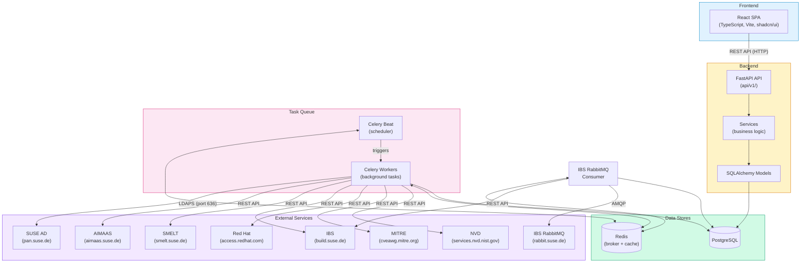
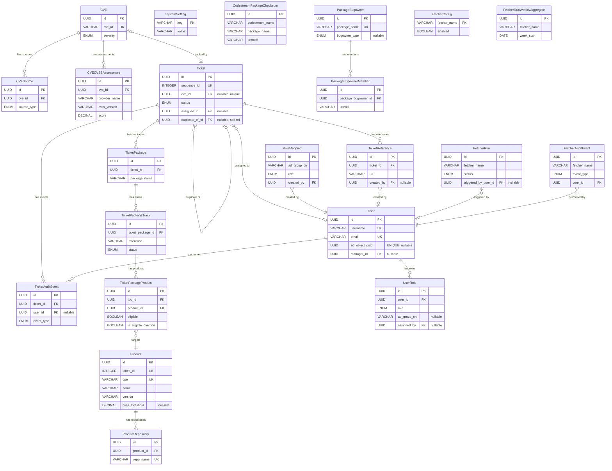
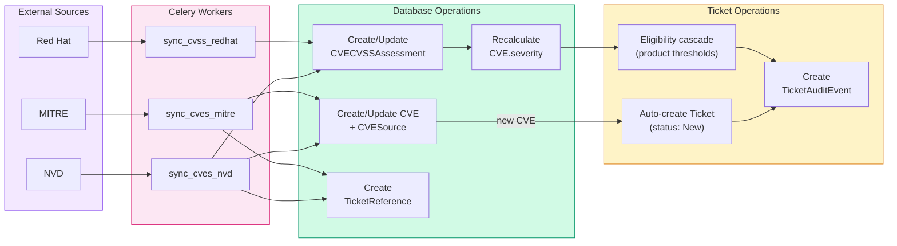
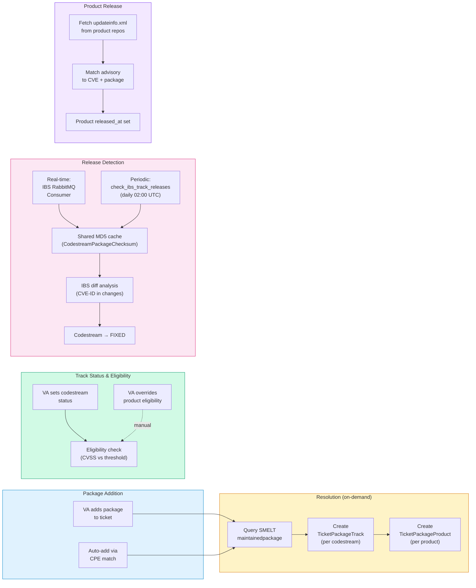
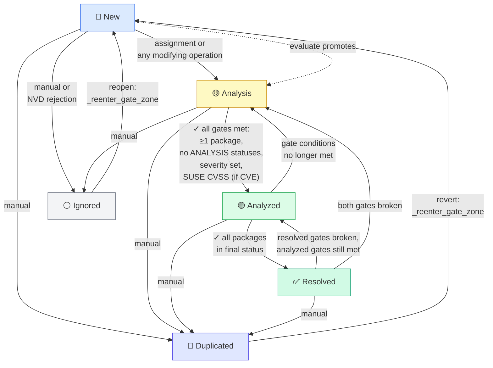
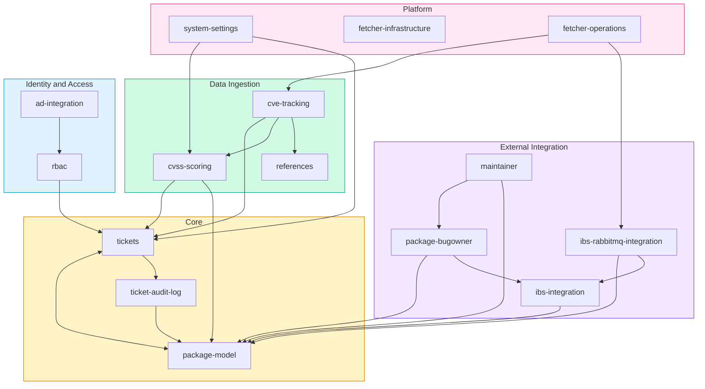

# System Map

Visual overview of the Sentinel platform. This document provides navigational
diagrams to understand how components, data, and features relate to each
other. For full details, follow the links to the relevant specification
documents.

## Table of Contents

- [System Components](#system-components)
- [Data Model](#data-model)
- [Data Flows](#data-flows)
  - [CVE Ingestion](#cve-ingestion)
  - [Package and Release Tracking](#package-and-release-tracking)
  - [Ticket Lifecycle](#ticket-lifecycle)
- [Feature Specification Map](#feature-specification-map)

---

## System Components

How the main components of Sentinel connect to each other and to external
services. See [architecture.md](architecture.md) for full details.

---

## Data Model

Entity-relationship diagram showing all database tables and their
connections. Only primary keys and foreign keys are shown for readability.
See [data-model.md](data-model.md) for full column details.

### Entity Groups

| Group | Tables | Purpose |
|-------|--------|---------|
| **CVE Domain** | CVE, CVESource, CVECVSSAssessment | Vulnerability data from external sources |
| **Ticket Domain** | Ticket, TicketAuditEvent, TicketReference, TicketPackage, TicketPackageTrack, TicketPackageProduct | Security workflow and audit trail |
| **Product Domain** | Product, ProductRepository | SUSE distribution products and update repositories |
| **Identity Domain** | User, UserRole, RoleMapping | Users, roles, and AD group mappings |
| **Package Domain** | PackageBugowner, PackageBugownerMember | IBS package maintainer cache |
| **Fetcher Domain** | FetcherConfig, FetcherRun, FetcherAuditEvent, FetcherRunWeeklyAggregate | Background task monitoring |
| **Operational** | CodestreamPackageChecksum, SystemSetting | Release detection cache and system config |

---

## Data Flows

### CVE Ingestion

How CVEs flow from external sources into Sentinel and trigger ticket creation.
See [features/tickets/cve-tracking.md](features/tickets/cve-tracking.md) and
[features/tickets/cvss-scoring.md](features/tickets/cvss-scoring.md).

### Package and Release Tracking

How packages are resolved, tracked across codestreams and products, and how
releases are detected. See
[features/packages/package-model.md](features/packages/package-model.md),
[features/integrations/ibs-integration.md](features/integrations/ibs-integration.md), and
[features/integrations/ibs-rabbitmq-integration.md](features/integrations/ibs-rabbitmq-integration.md).

### Ticket Lifecycle

State machine for ticket status transitions. Gates control automatic
transitions between Analysis, Analyzed, and Resolved. See
[features/tickets/tickets.md](features/tickets/tickets.md).

**Analyzed gate** (all must be true):
- At least one package added to the ticket
- No `TicketPackageTrack` in `ANALYSIS` status
- Severity is set (non-None)
- If CVE is associated: SUSE CVSS assessment exists

**Resolved gate**: all active `TicketPackageTrack` records are in a final
status (`FIXED`, `NOT_AFFECTED`, or `WONT_FIX`) and all eligible products
under `FIXED` tracks have `released_at IS NOT NULL`. Tracks/products are
soft-deleted rather than using a separate `IGNORED` status. Delivery status
(`PENDING`/`IN_PROGRESS`/`RELEASED`) is tracked independently for workflow
visibility but is not a gate condition.

---

## Feature Specification Map

How the 30 feature specifications relate to each other. Arrows indicate
dependencies (A → B means A depends on or references B). Specs are
grouped by domain. See individual specs in [features/](features/).

### Hub Specifications

The two most interconnected specifications, referenced by almost every
other feature:

- **[tickets](features/tickets/tickets.md)**: the central workflow entity — ticket
  creation, lifecycle, status gates, severity resolution. The service-layer
  module contract is in
  [ticket-mutations](features/tickets/ticket-mutations.md)
- **[package-model](features/packages/package-model.md)**: codestream/product
  resolution, status propagation, eligibility rules, and release detection

### Specification Index

| Spec | Domain | Summary |
|------|--------|---------|
| [tickets](features/tickets/tickets.md) | Core | Ticket entity, lifecycle, gates, severity resolution |
| [ticket-audit-log](features/tickets/ticket-audit-log.md) | Core | Audit trail via TicketAuditEvent records |
| [package-model](features/packages/package-model.md) | Core | Track affectedness, product eligibility, and release detection |
| [cve-tracking](features/tickets/cve-tracking.md) | Ingestion | CVE sync from NVD, MITRE, and other sources |
| [cvss-scoring](features/tickets/cvss-scoring.md) | Ingestion | Multi-provider CVSS assessment and severity derivation |
| [references](features/tickets/ticket-references.md) | Ingestion | External links on tickets (auto and manual) |
| [ibs-integration](features/integrations/ibs-integration.md) | Integration | IBS API client for source info, diffs, bugowners |
| [ibs-rabbitmq-integration](features/integrations/ibs-rabbitmq-integration.md) | Integration | Real-time release detection via IBS RabbitMQ |
| [package-bugowner](features/packages/package-bugowner.md) | Integration | IBS package maintainer cache |
| [ad-integration](features/identity/ad-integration.md) | Identity | SUSE AD sync for user provisioning and roles |
| [rbac](features/identity/rbac.md) | Identity | Role-based access control and permissions |
| [system-settings](features/platform/system-settings.md) | Platform | System settings (default CVSS version) |
| [fetcher-infrastructure](features/platform/fetcher-infrastructure.md) | Platform | BaseFetcher base class, registry, data model |
| [fetcher-operations](features/platform/fetcher-operations.md) | Platform | Background task monitoring, API, and CLI |
| [maintainer](features/packages/maintainer.md) | Integration | Maintainer-oriented package/ticket views |
